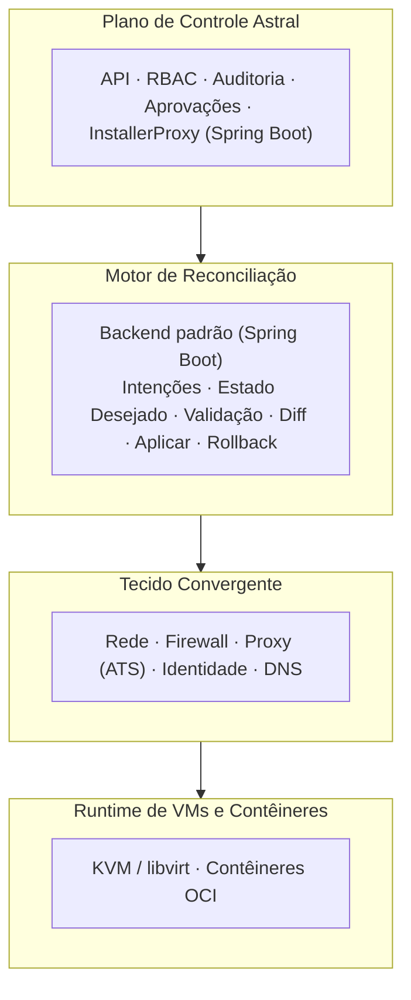
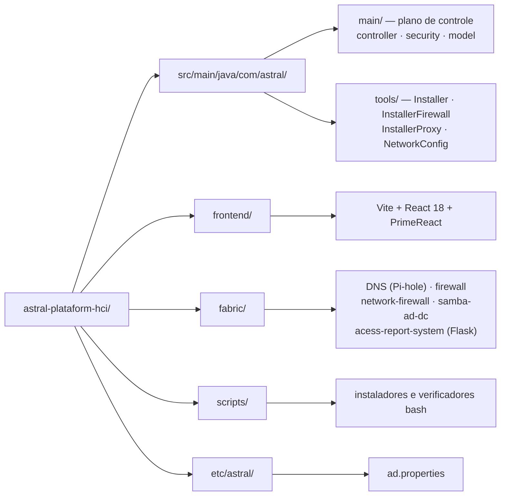

# Astral Platform & HCI

**Infraestrutura Hiperconvergente (HCI) aberta** — uma plataforma de rede,
segurança e identidade orientada por intenções, que trata computação,
firewall, identidade e DNS como primitivos de infraestrutura de primeira
classe, e não como serviços auxiliares.

Astral unifica VMs e contêineres em um único tecido convergente, governado por
um plano de controle auditável, com intenções explícitas, aprovação humana e
rollback.

Este projeto está sob **GNU AGPL v3**. Ver [`LICENSE.md`](LICENSE.md), e as
dependências de terceiros em [`NOTICE.md`](NOTICE.md).

📖 **Documentação completa em português:** [`README.pt-BR.md`](docs/i18n/README.pt-BR.md)

---

## 🌐 Escolha o seu idioma / Choose your language

| | Idioma | Documentação |
|---|--------|--------------|
| 🇧🇷 | **Português (Brasil)** | [README.pt-BR.md](docs/i18n/README.pt-BR.md) |
| 🇺🇸 | **English** | [README.en-US.md](docs/i18n/README.en-US.md) |
| 🇪🇸 | **Español** | [README.es-ES.md](docs/i18n/README.es-ES.md) |
| 🇫🇷 | **Français** | [README.fr-FR.md](docs/i18n/README.fr-FR.md) |

🇧🇷 [Português](docs/i18n/README.pt-BR.md) ·
🇺🇸 [English](docs/i18n/README.en-US.md) ·
🇪🇸 [Español](docs/i18n/README.es-ES.md) ·
🇫🇷 [Français](docs/i18n/README.fr-FR.md)

---

## 🧭 O problema

Plataformas modernas sofrem com problemas estruturais recorrentes:

- **Complexidade artificial** introduzida por produtos em camadas
- **Lock-in de fornecedores** disfarçado de "recursos corporativos"
- **Certificações caras** usadas como barreiras operacionais
- **Planos de controle opacos** e frágeis

Rede, firewall, identidade e computação são tratados como silos separados, o
que aumenta o risco operacional e a carga cognitiva. Astral resolve isso
colapsando os silos em um único plano de controle autoritativo e observável.

## 💡 Filosofia de design

Princípios inegociáveis:

- **Determinismo** sobre mágica
- **Auditabilidade** sobre conveniência
- **Fallback** sobre dependência
- **Autoridade humana** sobre automação

## 🏗 Arquitetura

## 🔐 Segurança e identidade

A autenticação é **multiorigem**: PostgreSQL e Active Directory, combinadas
por `MultiSourceAuthenticationProvider`. O Apache Traffic Server delega a
autenticação ao Astral por meio do módulo `authproxy.so`.

- **Sessão por cookie** `HttpOnly` + `SameSite=Lax`, com `Secure` ativado por
  `ASTRAL_COOKIE_SECURE` quando há TLS na frente
- **Kerberos/LDAP** contra o Samba AD DC, com segredos apenas em disco
  (`auth.env`, fora do versionamento)
- **RBAC e trilha de auditoria** no plano de controle
- **`ddl-auto=none`**: o Astral não altera o schema do banco sem migração
  explícita

> ℹ O projeto **não usa JWT**. A sessão é stateful, no servidor. Ver a seção
> *Security Measures* no README do seu idioma.

## ⚠️ Degradação segura

Astral falha sem se tornar um problema novo:

| Falha | Comportamento |
|---|---|
| API indisponível | Nenhuma mudança é aplicada; o runtime continua |
| Motor de reconciliação parado | O último estado commitado permanece |
| Banco indisponível | Configuração congelada; workloads continuam |
| Sistemas externos indisponíveis | Apenas as sugestões são desativadas |

A operação manual sempre permanece possível.

## 🗂 Estrutura do repositório

## 📅 Status do projeto

Em desenvolvimento inicial. [`projectupdates.md`](projectupdates.md) é o
documento vivo com a linha do tempo, o rationale e as decisões de projeto.

| Módulo | Estado |
|---|---|
| Plano de controle (API, RBAC, auditoria, aprovações) | 🟡 Em desenvolvimento |
| Autenticação multiorigem (AD + PostgreSQL) | 🟢 Funcionando |
| DNS com Pi-hole | 🟢 Funcionando |
| Samba AD DC multi-distro | 🟢 Funcionando |
| Firewall e proxy ATS | 🟢 Funcionando |
| Frontend PrimeReact | 🟡 Em desenvolvimento |
| Computação (KVM/libvirt) | 🟡 Base instalada; módulo em construção |
| Replicação de armazenamento (DRBD) | 🔴 Planejado — ainda não implementado |

---

## ❤️ Apoie o Projeto

Astral Platform & HCI é uma plataforma de infraestrutura livre, mantida por um
único desenvolvedor.

Se este projeto ajudou você, sua empresa ou sua equipe, considere apoiar o
desenvolvimento.

**PIX:** `24adc62c-b073-4587-974d-03fe35f6733f`

### 💳 Transferência internacional (Wise)

A chave PIX não funciona fora do Brasil.

**Se você envia de um banco dos Estados Unidos**, use estes dados para uma
transferência doméstica; **de qualquer outro lugar**, faça uma transferência
internacional Swift.

| | |
|---|---|
| **Nome** | Euripedes Batista de Paiva Junior |
| **Tipo de conta** | Checking |
| **Routing number** (wire e ACH) | `101019628` |
| **Número da conta** | `215822927677` |
| **Nome e endereço do banco** | Wise US Inc, 108 W 13th St, Wilmington, DE, 19801, United States |
| **SWIFT/BIC** | `TRWIUS35XXX` |

Os dados completos, com as instruções em quatro idiomas, estão nos READMEs:

🇧🇷 [`README.pt-BR.md`](docs/i18n/README.pt-BR.md) · 🇺🇸 [`README.en-US.md`](docs/i18n/README.en-US.md) ·
🇪🇸 [`README.es-ES.md`](docs/i18n/README.es-ES.md) · 🇫🇷 [`README.fr-FR.md`](docs/i18n/README.fr-FR.md)

---

## 🤝 Como contribuir

Leia o guia no seu idioma:

| Idioma | Guia |
|---|---|
| 🇧🇷 Português (Brasil) | [CONTRIBUTING.pt-BR.md](docs/i18n/CONTRIBUTING.pt-BR.md) |
| 🇺🇸 English | [CONTRIBUTING.en-US.md](docs/i18n/CONTRIBUTING.en-US.md) |
| 🇪🇸 Español | [CONTRIBUTING.es-ES.md](docs/i18n/CONTRIBUTING.es-ES.md) |
| 🇫🇷 Français | [CONTRIBUTING.fr-FR.md](docs/i18n/CONTRIBUTING.fr-FR.md) |

## 📄 Licença

**GNU Affero General Public License v3.0 (AGPLv3).** O texto completo e
inalterado está em [`LICENSE.md`](LICENSE.md).

A AGPLv3 exige que o código-fonte seja oferecido a quem usa o programa, inclusive
quando o uso é **pela rede** — por isso o "Affero". Para um plano de controle
acessado por navegador, essa cláusula é justamente a que importa: quem aponta o
navegador para este sistema tem direito ao código.

Dependências de terceiros são instaladas pelo sistema operacional ou
resolvidas em build, e **conservam suas próprias licenças**. A seção
*Serviços separados* do [`NOTICE.md`](NOTICE.md) lista o que não é AGPLv3 — em
particular o servidor Graylog, que é SSPL e não é redistribuído aqui.

© 2026 Astral Platform & HCI — **Criado por: Euripedes Batista de Paiva Junior**