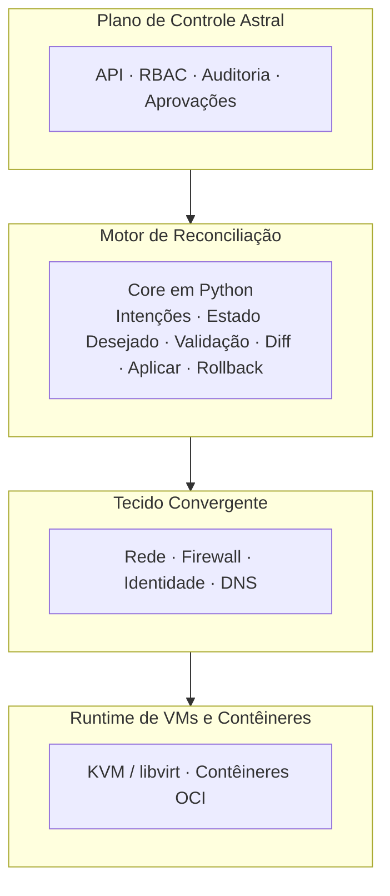
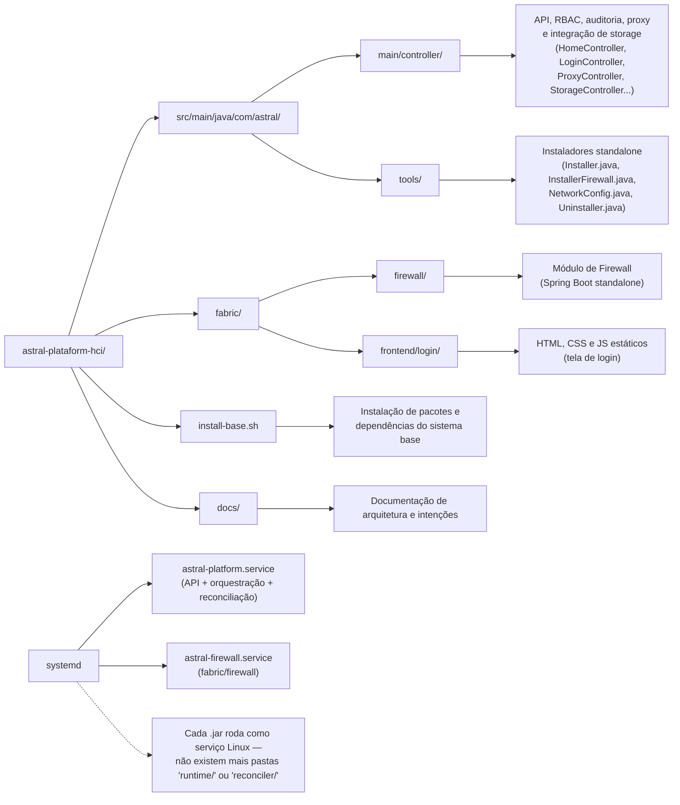

Astral HCI-NGFW
Resumo

Astral HCI-NGFW é uma plataforma de Infraestrutura Hiperconvergente (HCI) aberta, auditável e orientada por intenções, que trata rede, segurança e identidade como primitivos de infraestrutura de primeira classe, não como serviços auxiliares.

Astral unifica computação (VMs e contêineres), rede, firewall, identidade e DNS em um único tecido convergente, governado por um motor de reconciliação determinístico e operado por intenções explícitas, aprovações e rollback.

O projeto é lançado sob a licença GNU GPLv3, garantindo liberdade de longo prazo, transparência e resistência ao lock-in de fornecedores.
Problema

Plataformas modernas sofrem com problemas estruturais recorrentes:

    Complexidade artificial introduzida por produtos em camadas

    Lock-in de fornecedores disfarçado de “recursos corporativos”

    Certificações caras usadas como barreiras operacionais

    Planos de controle opacos e frágeis

Rede, firewall, identidade e computação são tratados como silos separados, aumentando risco operacional e carga cognitiva. Astral resolve isso colapsando os silos em um único plano de controle autoritativo, totalmente observável.
Filosofia de Design

Princípios inegociáveis:

    Determinismo sobre mágica

    Auditabilidade sobre conveniência

    Fallback sobre dependência

    Autoridade humana sobre automação

O que torna Astral HCI

Não é um hipervisor com add-ons, mas um sistema operacional de infraestrutura:

    Rede, firewall, identidade e DNS formam um domínio convergente

    VMs e contêineres consomem o mesmo tecido

    Todas as mudanças seguem o ciclo intenção → reconciliar → commit

    Rollback é obrigatório

Cada nó é independente ou parte de cluster.
Arquitetura
Plano de Controle

    API sem estado

    RBAC, aprovações e trilha de auditoria

    Operação CLI-first

Motor de Reconciliação

    Implementado em Python

    Valida intenções, calcula estado desejado vs observado

    Aplica mudanças em estágios com rollback automático

Persistência

    Banco relacional para estado autoritativo

    Data lake para telemetria histórica

Tecido Convergente

    Interfaces de rede, VLANs, firewall, NAT

    Controle de acesso baseado em identidade

    DNS com políticas

Filosofia de Integração

Astral integra componentes maduros (Samba, DNS, firewall) em um sistema coerente. Falhas em qualquer componente disparam rollback completo.
Computação e Contêineres

    Suporte a KVM/libvirt e contêineres OCI

    Ambos obedecem às mesmas regras de firewall e identidade

Armazenamento Distribuído

    DRBD com orquestração

    Replicação síncrona e auditável

Ciclo de Intenção

    Criação da intenção

    Autorização

    Reconciliação

    Validação

    Commit ou rollback

    Observação e auditoria

Observabilidade

    Rede, firewall, DNS, identidade, VMs e contêineres

    Detecção de drift contínua

Integração com CELESTE

    Projeto independente

    Sem dependência ou compartilhamento de plano de controle

    Interação apenas via APIs explícitas

Licenciamento

GPLv3 garante liberdade, transparência e proteção contra apropriação proprietária.
Conclusão

Astral HCI-NGFW é projetado para sobreviver a fornecedores e modismos, restaurando a infraestrutura como algo determinístico, auditável e operado por engenheiros.

Diagrama resumido:

Modelo Operacional

Astral é projetado para ser operado sem interface gráfica.
Métodos principais de interação:

    Ferramentas CLI

    Arquivos de intenção declarativos

    Automação via API

Modos de Falha e Operação Degradada

Astral degrada de forma segura:

    API indisponível → nenhuma mudança aplicada, runtime continua

    Motor de reconciliação parado → último estado commitado permanece

    Banco indisponível → configuração congelada, workloads continuam

    Sistemas externos indisponíveis → apenas sugestões desativadas

Operação manual sempre possível.
Escopo

Astral foca em:

    Computação (VMs e contêineres)

    Rede, firewall e roteamento

    Identidade e DNS

    Replicação de armazenamento

    Auditoria e observabilidade

Não é PaaS, Kubernetes ou abstração de cloud.
Não-Objetivos

Para preservar estabilidade, Astral evita:

    Automação oculta

    Infraestrutura auto-modificável

    Auto-remediação sem aprovação

    Configuração via UI

Status do Projeto

Astral HCI-NGFW está em desenvolvimento inicial.
Foco atual:

    Contratos do plano de controle

    Definição de esquema de intenções

    Fundamentos do motor de reconciliação

    Rede e firewall determinísticos

Estrutura do Repositório:

Declaração Final

Astral não é construído para seguir tendências.
É construído para:

    Ser compreendido

    Ser auditado

    Ser operado sob pressão

    Sobreviver a falhas de componentes

    Permanecer livre e defensável

Astral é infraestrutura para engenheiros que valorizam controle sobre conveniência.

