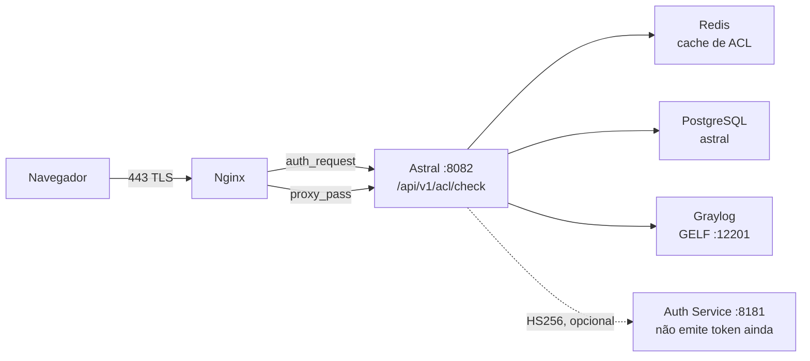

# 🔐 Guia de Integração — BrasilCloud Auth Service

> Contrato entre o **Astral Platform & HCI** e o **BrasilCloud Auth Service**
> (`:8181`), no caminho que decide se um domínio abre ou não.

## 📊 Status em uma frase

O motor de ACL do Astral **aceita** Bearer JWT do Auth Service, mas isso está
**desligado por padrão** — o Auth Service ainda é stateless com HTTP Basic e não
emite token. O caminho que funciona hoje é a **sessão do portal**. Ver a
[seção 28](#28-por-que-o-auth-service-não-deve-ser-documentado-como-jwt).

| | |
|---|---|
| **Precisa do Auth Service para funcionar?** | Não. A sessão do portal basta |
| **O Auth Service é chamado em runtime?** | Não. `:8181` não aparece em nenhum `.java` |
| **Quando o JWT é verificado?** | Só com `ASTRAL_AUTH_JWT_ENABLED=true` **e** segredo com ≥32 bytes |
| **Risco de o Auth Service cair?** | Nenhum para o ACL: a validação é local, por HS256 |

---

## 1. Para que serve este documento

Para quem vai **operar** a integração entre as duas pontas, e para quem vai
**implementar a emissão de token** no Auth Service. Ele descreve o que o Astral
espera, o que ele já tolera, e o que ainda não existe.

Não é um tutorial de OAuth 2.0. É o contrato concreto: quais headers, quais
claims, quais status, quais Defaults.

## 2. Quem é o BrasilCloud Auth Service

Um serviço de autenticação que roda em **`:8181`**, ao lado do Astral. Hoje ele é
*stateless* com HTTP Basic: valida credencial e não guarda estado.

Ele **não emite token**. Não há emissor, não há `iss`, não há JWKS. A única
coisa que o Astral sabe fazer com ele, hoje, é **validar um HS256 que outro
tenha assinado** — e essa validação está desligada por padrão.

## 3. Topologia: onde as duas pontas se encontram



O Asterisk tracejado é o ponto honesto do desenho: **ninguém chama o Auth
Service durante uma requisição**. A seta existe para o contrato, não para o
tráfego.

## 4. O caminho de uma requisição

1. O navegador pede `https://<host>/<uri>` na **443**.
2. O Nginx atende em `location /` e **antes** de qualquer `proxy_pass` dispara
   `auth_request /acl-check`.
3. `location = /acl-check` é `internal`: só o próprio Nginx chega nele.
4. O subrequest vai para `http://astral_app/api/v1/acl/check` — o upstream
   `astral_app` é `127.0.0.1:8082`.
5. O motor devolve **200**, **403** ou **401**. O Nginx aceita só esses três.
6. **200** → o Nginx segue para `proxy_pass http://astral_app`.
   **403** → `error_page 403 /bloqueado.html`, que o script escreve em
   `/etc/nginx/astral/bloqueado.html`.

## 5. O que o Nginx repassa ao motor

O bloco `location = /acl-check` em `scripts/configure-nginx.sh` monta o
subrequest com `proxy_pass_request_body off` e `Content-Length ""`, e repassa:

| Header | Valor | Para que serve |
|---|---|---|
| `Host` | `$host` | **Obrigatório** — veja a [seção 6](#6-por-que-o-cabeçalho-host-é-obrigatório) |
| `X-Original-Host` | `$host` | o host que o usuário digitou |
| `X-Original-URI` | `$request_uri` | o caminho que o usuário pediu |
| `X-Real-IP` | `$remote_addr` | — |
| `X-Forwarded-For` | `$proxy_add_x_forwarded_for` | o IP real do cliente |
| `Authorization` | repassado por padrão | o portador do `Bearer`, quando houver |

O `Authorization` **não** tem `proxy_set_header` próprio: o Nginx repassa os
headers do cliente por padrão e as linhas acima só adicionam. Se alguém
reescrever esse bloco e passar a listar headers um a um, o `Authorization` some
— e o JWT deixa de funcionar sem erro visível. É o tipo de regressão que a
[seção 16](#16-fonte-2--o-bearer-jwt) torna fácil de não notar.

No lado do motor, a leitura é (`AclCheckController`):

- **host**: `X-Original-Host` → `X-Forwarded-Host` → `Host`
- **uri**: `X-Original-URI` → `requestURI`, sem query string
- **ip**: `X-Forwarded-For`, **primeiro** valor da lista

## 6. Por que o cabeçalho Host é obrigatório

Sem essa linha, o Nginx usa o default `proxy_set_header Host $proxy_host`, e
`$proxy_host` de um upstream **nomeado** é o próprio nome do upstream:
`astral_app`.

O Tomcat recusa `Host` com underscore e responde **400**. O `auth_request` só
aceita 200/401/403, então os 400 viram **500 na página do usuário** — inclusive
nas páginas públicas, com um stack trace que não tem nada a ver com ACL. O
sintoma no log é `auth request unexpected status: 400`.

Não remova essa linha. Se mudar o nome do upstream, o problema volta.

## 7. O contrato de status

O motor tem **três** status possíveis, e nenhum outro:

| Status | `action` | O Nginx faz |
|---|---|---|
| **200** | `ALLOW` | deixa passar |
| **403** | `DENY` | `error_page 403 /bloqueado.html` |
| **401** | `UNAUTHENTICATED` ou `ERROR` | pede autenticação |

## 8. Por que nunca 500

Um 500 do motor vira página de erro no meio do proxy, e a causa fica invisível
para quem está tentando usar o sistema. Um **200 por dúvida** é fail-open com
outro nome — exatamente o que um controle de acesso não pode ser.

Por isso o fallback de infraestrutura é **401** e não 200: quando o motor não
sabe decidir, ele **diz que não sabe**. `AclDecision.erro()` devolve 401 com
`action=ERROR`, e o comentário no código é literal sobre isso.

## 9. Métodos aceitos: GET e POST

O endpoint aceita os dois métodos. O corpo **não** é lido: quem decide é o host,
a URI e a identidade. Aceitar `POST` é conveniência para ferramentas que não
controlam o método; o `auth_request` do Nginx usa `GET`.

## 10. O corpo da resposta

O Nginx **descarta** o corpo do subrequest. Ele existe para que o endpoint seja
testável só com `curl` — e endpoint de segurança que não dá para testar sem
navegador vira achado no próximo audit.

```json
{
  "status": 403,
  "action": "DENY",
  "host": "exemplo.com",
  "uri": "/app/index.html",
  "categoria": "JOGOS",
  "grupo": "ALUNOS",
  "origem": "RECONCILIA",
  "motivo": "categoria bloqueada para o grupo",
  "usuario": "joao",
  "fonte": "SESSAO/AD",
  "ip": "192.168.2.50",
  "ms": 2
}
```

| Campo | O que é |
|---|---|
| `status` | o mesmo que o status HTTP |
| `action` | `ALLOW`, `DENY`, `UNAUTHENTICATED` ou `ERROR` |
| `categoria` | a categoria do domínio |
| `grupo` | os grupos que entraram na decisão |
| `origem` | de onde veio a decisão (ex.: `RECONCILIA`) |
| `motivo` | a frase que um humano entende |
| `usuario` | quem pediu |
| `fonte` | de onde veio a **identidade** (ex.: `SESSAO/AD`, `JWT`) |
| `ms` | quanto tempo o motor levou |

## 11. Como testar sem subir o Nginx

O endpoint é `permitAll` no `SecurityConfig` — de propósito, porque quem faz o
portão de verdade é o `auth_request`. Isso o deixa direto no `curl`:

```bash
curl -i -H 'X-Original-Host: exemplo.com' \
        -H 'X-Original-URI: /app/index.html' \
        http://127.0.0.1:8082/api/v1/acl/check
```

Repare que **não** há `Authorization`: sem Bearer e sem sessão, a resposta é
**401**, e o `motivo` diz exatamente qual das duas faltou. Um 403 aqui é
resposta de política; um 401 é resposta de credencial.

## 12. Caminhos públicos: por que existem

A lista é configurável em `astral.acl.public-paths`, separada por vírgula —
justamente para não depender de redeploy quando um caminho novo é publicado. O
padrão são 13 entradas:

```
/  /login  /home  /inicio  /app/  /assets/  /favicon.ico
/api/auth/login  /api/certs/ca/download  /error
/actuator/  /v3/api-docs/  /swagger-ui/
```

Duas delas merecem atenção de quem revisa: `/` está na lista porque é o redirect
inicial, e **`/actuator/` é pública** — o que inclui `/actuator/health`. Um
health check não deveria expor detalhe de sistema a qualquer visitor da 443;
se o seu ambiente não pode assumir isso, tire a entrada em vez de filtrar
caminho por caminho.

Fora dessa lista, tudo responde **antes** de olhar identidade, com
`origem=PUBLICA` e `motivo="caminho publico (sem ACL)"`.

Sem isso o Nginx exigiria identidade **para chegar ao login** — que é trancar a
porta por dentro.

## 13. Duas listas que precisam concordar

O `permitAll` do `SecurityConfig` e o `astral.acl.public-paths` do motor são a
**mesma decisão escrita duas vezes**, em lugares diferentes.

Se divergirem, **não é furo de segurança** — o Spring Security continua sendo o
portão de verdade das APIs. O sintoma é um login bloqueado ou uma tela pública
que pede sessão. É a primeira coisa a conferir quando qualquer um dos dois
parar de casar.

## 14. As duas fontes de identidade

`AclIdentityResolver` tenta, **nesta ordem**:

1. **Bearer JWT** — o contrato do diagrama.
2. **Sessão do portal** — quem já logou.

A primeira que resolver ganha. Se as duas falharem, o motor devolve 401 com
origem `IDENTIDADE`.

A escolha é verificada **localmente**, por HS256, e não pedindo confirmação ao
Auth Service a cada requisição: isso trocaria um motor de 2ms por uma chamada de
rede por página, e o Auth Service fora do ar passaria a decidir navegação.

## 15. Fonte 1 — a sessão do portal

É o caminho que funciona **hoje**.

O `SecurityContextHolder` fornece a autenticação. Quando o principal é um
`AstralPrincipal`, o usuário vem do AD e os grupos de `getAdGroups()`, com
`fonte` = `SESSAO/<origem>` (ex.: `SESSAO/AD`).

Quando o principal **não** é um `AstralPrincipal` — a fonte `POSTGRES/LINUX` —,
a identidade vale mas o grupo não: os `authorities` viram grupos depois de
remover `ROLE_`, `USER` e `ADMIN`, em minúsculas, com `fonte=SESSAO`. É esse
caso que a regra com curinga `*` cobre.

## 16. Fonte 2 — o Bearer JWT

Lê-se `Authorization: Bearer <token>`. O `sub` vira usuário, os grupos vêm das
claims. Um token expirado, com assinatura errada ou de segredo divergente **não
é erro do motor** — é credencial que não passou. Cai para a sessão, com log em
`debug`.

O decodificador só existe se `astral.auth.jwt.enabled=true` **e** o segredo
tiver ≥32 bytes. Se faltar um dos dois, `decoder` fica `null` e o caminho do
Bearer nem é tentado.

## 17. Qual claim vira usuário, qual vira grupo

| Claim | Uso |
|---|---|
| `sub` | **usuário** — obrigatório; sem `sub` o token é descartado |
| `groups` | grupos (primeira claim presente vence) |
| `roles` | grupos, se `groups` não existir |
| `memberOf` | grupos, se as duas anteriores não existirem |
| `realm_access.roles` | grupos, formato Keycloak |

Os grupos são normalizados em **maiúsculas, ordenados e deduplicados**, porque a
chave de cache precisa ser canônica: o mesmo conjunto em ordens diferentes tem
que cair na mesma entrada.

## 18. HS256 e o segredo compartilhado

O decodificador é `NimbusJwtDecoder.withSecretKey(...).macAlgorithm(HS256)`, com
o segredo vindo de `astral.auth.jwt.secret`.

É **HS256**, não RS256: a assinatura é simétrica, então **os dois lados
precisam do mesmo segredo**. Não há chave pública para distribuir e não há JWKS
para consultar. Isso é o contrato com um Auth Service que vive na mesma máquina
e na mesma rede.

Para o Auth Service ganhar emissão, ele precisa assinar com **o mesmo segredo**.
Divergir não dá erro visível: o token simplesmente é recusado e cai para a
sessão.

## 19. A exigência dos 32 bytes

`HS256` com menos de 256 bits é força bruta na Horizontal. Se o segredo tiver
menos de 32 bytes, o código **não valida nada** e registra:

```
acl: astral.auth.jwt.secret com menos de 32 bytes;
verificacao de Bearer DESLIGADA ate corrigir
```

Preferimos não validar a nada a validar mal. Com `ASTRAL_AUTH_JWT_ENABLED=true` e
segredo curto, o ACL **continua funcionando** pela sessão — só o Bearer é
ignorado.

## 20. `ASTRAL_AUTH_JWT_ENABLED`

O interruptor. Padrão **`false`**.

| Variável | Padrão | O que faz |
|---|---|---|
| `ASTRAL_AUTH_JWT_ENABLED` | `false` | Liga a decodificação do Bearer |
| `ASTRAL_AUTH_JWT_SECRET` | vazio | Segredo HS256 compartilhado |

Para ligar: `ASTRAL_AUTH_JWT_ENABLED=true` e um segredo de ≥32 bytes, **igual nos
dois lados**. Sem ligar, o caminho do JWT existe no código mas nunca executa.

## 21. O que a validação NÃO verifica

Isto importa para quem implementa a emissão:

- **Não valida `iss`.** Não há emissor esperado.
- **Não valida `aud`.** Não há audiência esperada.
- **Não valida `nbf` além do relógio.** O validador é um `JwtTimestampValidator`
  com **tolerância de 60 segundos** — o padrão do Spring é 60s de relógio, e o
  que muda aqui é que ele foi **trocado** por um validador só de tempo.

Ou seja: um token HS256 válido, com `sub`, dentro da janela de tempo, é aceito.
Ponha no token tudo que precisar ser verificado.

## 22. Grupo decide passagem; papel decide edição

`AclIdentity` **não** é uma autoridade do Spring nem um principal de segurança.
É o recorte mínimo que a política cruza com a categoria do domínio.

- **Papel** decide quem **edita** a política. O CRUD inteiro
  (`/api/v1/acl/{categories,domains,overrides,rules}`) está atrás de
  `@PreAuthorize("hasRole('ASTRAL_ADMIN')")` na classe `AclAdminController` —
  é o único lugar do motor onde o papel aparece.
- **Grupo** decide quem **passa**, e isso é o `AclRule.adGroup`.

Misturar os dois é como uma permissão de administrador virar liberação de
navegação. O `source` fica no registro de propósito: a auditoria pergunta "de
onde veio esta identidade", e uma resposta sem essa pergunta não serve para
investigação posterior.

## 23. Os quatro passos do motor

Sempre nesta ordem — a ordem **é** a política:

| Passo | O quê | Onde |
|---|---|---|
| **A** | exceção explícita de domínio | índice em memória |
| — | cache de decisão (15 min) | Redis |
| **B** | categoria do domínio | Redis → PostgreSQL |
| **C** | regra categoria × grupo | Redis → PostgreSQL |

O **PASSO A** vem antes de tudo porque exceção é quando o operador disse "deste
host específico, nada": rodar depois do cruzamento obrigaria o operador a
escrever a exceção também na categoria.

A exceção tem quatro ações, e uma delas não é uma decisão: **`BYPASS` pula o
motor inteiro, inclusive o cache**, devolvendo `ALLOW` com origem
`PASSO_A/bypass`. É a "exceção de manutenção" — para o caso em que nem o
cruzamento comum serve.

## 24. Os dois defaults

| Situação | Default | Configurável |
|---|---|---|
| Categoria existe, nenhuma regra cobre o grupo | **`DENY`** | `astral.acl.default-without-rule` |
| O domínio nem categoria tem | **`ALLOW`** | `astral.acl.default-uncategorized` |

O default da casa é `DENY`. O `ALLOW` para não categorizado existe porque há
ambientes que querem "só o que está marcado como bloqueado por padrão é negado" —
é escolha consciente, não default.

Esses defaults fecham o motor: **sem identidade 401, sem categoria a política
decide, sem regra a política decide**.

## 25. Redis: TTLs e o fallback

| Chave | TTL | Por que |
|---|---|---|
| domínio → categoria | 1h | muda raramente |
| categoria + grupo → ação | 5m | muda quando a regra muda |
| identidade + domínio → decisão | 15m | caminho quente |
| índice de exceções | 60s | exceção nova precisa valer rápido |

O timeout do Redis é **500 ms** de propósito: se ele cair, o fallback para o
PostgreSQL tem que acontecer em milissegundos, e não depois de 5s por requisição.

O **índice de exceções tem TTL mesmo** porque reconstruir a cada requisição
transformaria os 2ms em consulta ao banco.

## 26. Auditoria e retenção

Cada decisão vira evento **GELF sobre UDP**, escrito à mão, sem dependência
nova, para o Graylog em `:12201`. A fila tem teto de 8192. Se o Graylog sumir,
um **JSONL de fallback** guarda a trilha em
`/var/log/astral/graylog-fallback.jsonl`.

As séries ficam em **hypertables do TimescaleDB**, com **retenção de 30 dias** —
o horizonte em que um pico de sexta ainda é comparável ao da sexta seguinte.
São ~5.760 linhas/dia por série × 4 séries × 30 dias ≈ 700 mil linhas.

O `drop_chunks` é o que impede a série de virar incidente de disco. E a
conversão para hypertable fica em **script**, não em migração, porque
`create_hypertable` exige superuser e o Flyway roda como `astral`, que não é.

## 27. O que acontece se o Auth Service cair

**Nada muda no ACL.** Porque nada no caminho quente o chama.

O motor valida o Bearer **localmente**, por HS256. O Auth Service fora do ar
não entra em nenhuma equação — nem para deny, nem para allow.

O que quebra, se alguma vez o Auth Service passar a emitir, é a **emissão** do
token: o usuário sem sessão e sem token vai receber 401 com
`action=UNAUTHENTICATED`, e `motivo` dirá que faltou Bearer válido **e** sessão.

## 28. Por que o Auth Service não deve ser documentado como JWT

Esta seção existe porque a tentação é grande e o erro é caro.

**O Auth Service de `:8181` não emite token hoje.** Documentá-lo como emissor
JWT faria três coisas erradas de uma vez:

1. **Faria o ACL parecer opcional.** Se o JWT fosse o caminho normal, desligar
   `ASTRAL_AUTH_JWT_ENABLED` pareceria um erro de configuração. Não é: é o
   padrão, e o ACL funciona assim desde que a sessão do portal existe.
2. **Faria o 401 parecer bug.** Um `401 UNAUTHENTICATED` com
   `motivo="sem Bearer valido e sem sessao do portal"` é a **duas fontes
   falharem**, que é o comportamento projetado — não um JWT quebrado.
3. **Faria o Cache TTL de 15 minutos parecer seguro por conta própria.** A
   decisão é cacheada com a identidade que a produziu; se essa identidade veio
   de uma sessão anulada, o cache segura o resultado antigo. TTL curto
   amortece, não resolve.

Até o Auth Service ganhar emissão de verdade, o honesto é o que está no
`application.properties`:

```
astral.auth.jwt.enabled=${ASTRAL_AUTH_JWT_ENABLED:false}
```

Desligado por padrão. Validar um JWT que ninguém emite é trabalho por nada.

**Quando a emissão existir**, três coisas precisam mudar junto, e só nessa
ordem:

1. O Auth Service passa a assinar com `HS256` e o **mesmo** segredo de
   `ASTRAL_AUTH_JWT_SECRET`.
2. `ASTRAL_AUTH_JWT_ENABLED=true` no ambiente, com ≥32 bytes.
3. Só então o JWT vira documentável como caminho de produção — e a
   [seção 19](#19-a-exigência-dos-32-bytes) passa a ser o primeiro número a
   checar quando ninguém conseguir passar.

---

## ✅ Checklist de integração

- [ ] `ASTRAL_AUTH_JWT_ENABLED=false` e `ASTRAL_AUTH_JWT_SECRET` vazio — o padrão, e está funcionando
- [ ] `curl` em `/api/v1/acl/check` devolve **401** sem Bearer e sem sessão (não 500)
- [ ] O mesmo `curl` com sessão válida devolve **200** ou **403** conforme a política
- [ ] `astral.acl.public-paths` e o `permitAll` do `SecurityConfig` casam
- [ ] O Nginx tem `proxy_set_header Host $host` no `location = /acl-check`
- [ ] O `error log` não tem `auth request unexpected status: 400`
- [ ] O JSONL de fallback do Graylog existe e está crescendo
- [ ] Se o JWT foi ligado: o segredo tem ≥32 bytes e é **igual** ao do Auth Service
- [ ] Se o JWT foi ligado: o token traz `sub` e os grupos em `groups`, `roles` ou `memberOf`

## 📎 Índice de referências

| O quê | Onde |
|---|---|
| Endpoint | `src/main/java/com/astral/fabric/proxy/AclCheckController.java` |
| Motor | `src/main/java/com/astral/fabric/proxy/AclEvaluatorService.java` |
| Fontes de identidade | `src/main/java/com/astral/fabric/proxy/AclIdentityResolver.java` |
| Contrato de status | `src/main/java/com/astral/fabric/proxy/AclDecision.java` |
| Recorte de identidade | `src/main/java/com/astral/fabric/proxy/AclIdentity.java` |
| Cache | `src/main/java/com/astral/fabric/proxy/AclCacheService.java` |
| Auditoria | `src/main/java/com/astral/fabric/proxy/audit/GraylogAuditPublisher.java` |
| Chave ACL (o `permitAll` do check) | `src/main/java/com/astral/main/security/SecurityConfig.java` |
| Bloco Nginx | `scripts/configure-nginx.sh` |
| Retenção | `scripts/configure-timescaledb.sh` |
| Configuração | `src/main/resources/application.properties` |

---

*Este documento descreve o código como ele está. Se a emissão de token mudar no
Auth Service, atualize a [seção 28](#28-por-que-o-auth-service-não-deve-ser-documentado-como-jwt)
e o checklist — não deixe a seção 28 envelhecer.*