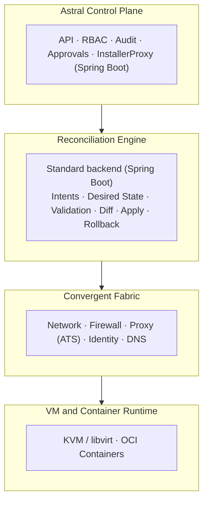
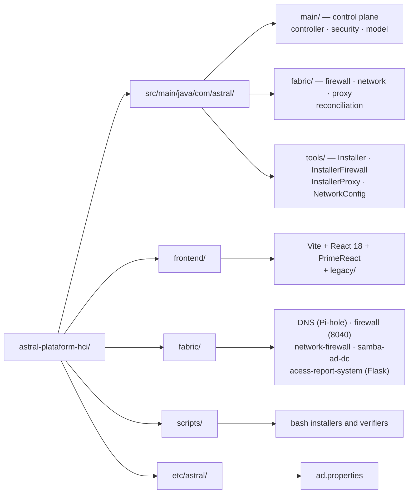

# Astral Platform & HCI


**Open Hyperconverged Infrastructure (HCI)** — an intent-driven platform for
networking, security and identity that treats compute, firewall, identity and
DNS as first-class infrastructure primitives rather than auxiliary services.

Astral unifies VMs and containers into a single convergent fabric, governed by
an auditable control plane with explicit intents, human approval and rollback.

This project is licensed under the **GNU AGPL v3**. See
[`LICENSE.md`](../../LICENSE.md), and third-party dependencies in
[`NOTICE.md`](../../NOTICE.md).

## 🌐 Choose your language / Escolha o seu idioma

| | Language | Documentation |
|---|----------|---------------|
| 🇧🇷 | **Português (Brasil)** | [README.pt-BR.md](README.pt-BR.md) |
| 🇺🇸 | **English** | [README.en-US.md](README.en-US.md) |
| 🇪🇸 | **Español** | [README.es-ES.md](README.es-ES.md) |
| 🇫🇷 | **Français** | [README.fr-FR.md](README.fr-FR.md) |

---

## 📋 Table of contents

- [🧭 Overview](#-overview)
- [❌ The problem](#-the-problem)
- [💡 Design philosophy](#-design-philosophy)
- [🌟 What makes Astral different](#-what-makes-astral-different)
- [🏗 Architecture](#-architecture)
- [🔐 Security and identity](#-security-and-identity)
- [🔄 The intent cycle](#-the-intent-cycle)
- [📊 Observability](#-observability)
- [🖥 Operating model](#-operating-model)
- [⚠️ Failure modes and degraded operation](#-failure-modes-and-degraded-operation)
- [🎯 Scope](#-scope)
- [🚫 Non-goals](#-non-goals)
- [🗂 Repository layout](#-repository-layout)
- [🚀 Installation](#-installation)
- [🧪 Build](#-build)
- [📅 Status and roadmap](#-status-and-roadmap)
- [🛰 Integration with CELESTE](#-integration-with-celeste)
- [❤️ Support the project](#-support-the-project)
- [📄 License](#-license)

---

## 🧭 Overview

Astral Platform & HCI (also referred to as **Astral HCI-NGFW**) is an open,
auditable, intent-driven hyperconverged infrastructure platform.

It unifies compute (VMs and containers), networking, firewall, identity and DNS
into a **single convergent fabric**, governed by a deterministic reconciliation
engine and operated through explicit intents, approvals and rollback.

Each node is standalone or part of a cluster.

## ❌ The problem

Modern platforms suffer from recurring structural problems:

- **Artificial complexity** introduced by products in layers
- **Vendor lock-in** disguised as "enterprise features"
- **Expensive certifications** used as operational barriers
- **Opaque and fragile** control planes

Networking, firewall, identity and compute are treated as separate silos, which
raises operational risk and cognitive load. Astral addresses this by collapsing
the silos into a single authoritative, fully observable control plane.

## 💡 Design philosophy

Non-negotiable principles:

- **Determinism** over magic
- **Auditability** over convenience
- **Fallback** over dependency
- **Human authority** over automation

## 🌟 What makes Astral different

It is not a hypervisor with add-ons, but an **infrastructure operating
system**:

- Networking, firewall, identity and DNS form one convergent domain
- VMs and containers consume the same fabric
- Every change follows `intent → reconcile → commit`
- **Rollback is mandatory**, not optional

## 🏗 Architecture



### 📦 Components

| Layer | Technology | Where |
|---|---|---|
| Control plane | Spring Boot 3.3.5 / Java 21 | `src/main/java/com/astral/main/` |
| Installation tooling | Java 21 | `src/main/java/com/astral/tools/` |
| Frontend | Vite + React 18 + PrimeReact | `frontend/` |
| DNS | Pi-hole | `fabric/DNS/` |
| Firewall (legacy, retired) | Separate Java app (14 JPA entities, port 8040) | `fabric/firewall/` |
| Firewall inside the platform | Copy of the same 14 entities, not deployed yet | `src/main/java/com/astral/fabric/firewall/` |
| Network firewall | Python | `fabric/network-firewall/` |
| Active Directory DC | Samba AD, multi-distro | `fabric/samba-ad-dc/` |
| Access reports | Flask + PostgreSQL | `fabric/acess-report-system/` |
| Auth proxy | Apache Traffic Server | `scripts/configure-ats-auth.sh` |
| Historical telemetry | Elasticsearch | `installbase.sh` |
| Reconciliation queue | RabbitMQ (intents) | `fabric/reconciliation/` |
| ACL cache | Redis | `fabric/proxy/` |
| Historical metrics | TimescaleDB (hypertables, 30 days) | `scripts/configure-timescaledb.sh` |
| API contract | OpenAPI/Swagger 3 | `/v3/api-docs`, `/swagger-ui/` |

### 💾 Persistence

- **Relational database** for authoritative state (PostgreSQL)
- **Data lake** for historical telemetry (Elasticsearch)

> ⚠️ `spring.jpa.hibernate.ddl-auto` is `validate` and **Flyway is enabled**.
> The versioned migration lives in `src/main/resources/db/migration/`: `V1` is
> the baseline of the state that already existed and `V100` is the first real
> change after it. `validate` makes startup **fail** if the database does not
> match the Java — the opposite of `none`/`update`, which hide the divergence
> until it becomes a production bug.
>
> ⚠️ The legacy `fabric/firewall/` app (port 8040) is **retired but still in the
> repository**, with its own `pom.xml` and the same 14 entities — and it also
> validates with Flyway. `InstallerFirewall.java` still deploys it, but nothing in
> the main application reads `astral.firewall.url` anymore, and the service does
> not answer. The migration into `src/main/java/com/astral/fabric/` is what will
> delete it.

### 🖧 Convergent fabric

- Network interfaces, VLANs, firewall, NAT
- Identity-based access control
- Policy-driven DNS

### 💽 Compute and containers

- Support for **KVM/libvirt** (QEMU) and OCI containers
- Both obey the same firewall and identity rules

> ℹ The KVM/libvirt base is installed by `installbase.sh` (phase 15/16). The VM
> orchestration module is under construction — see
> [Status](#-status-and-roadmap).

## 🔐 Security and identity

Authentication is **multi-source**: PostgreSQL and Active Directory, combined by
`MultiSourceAuthenticationProvider`. Apache Traffic Server delegates
authentication to Astral through the `authproxy.so` module.

| Measure | Implementation |
|---|---|
| **Authentication** | Spring Security + LDAP/Kerberos + PostgreSQL |
| **Session cookie** | `HttpOnly`, `SameSite=Lax`, `Secure` via `ASTRAL_COOKIE_SECURE` |
| **Session expiry** | 8 hours |
| **Secrets** | `auth.env` on disk, **not** version-controlled |
| **Database** | `ddl-auto=validate` + Flyway (`db/migration/`) |
| **Authorization** | RBAC with human approval in the control plane |
| **Audit** | Audit trail in the control plane |

> ℹ The UI and the ACL engine use a **stateful session** on the server, with an
> `HttpOnly` cookie. `/api/v1/acl/check` **accepts** a Bearer HS256 JWT from the
> BrasilCloud Auth Service, but validation is **off by default**
> (`ASTRAL_AUTH_JWT_ENABLED=false`): the Auth Service does not issue tokens yet,
> so the working path is the session. Full contract in the
> [integration guide](../GUIA-INTEGRACAO-AUTH-SERVICE.md) (PT-BR). The trusted
> proxy header is enabled (`server.forward-headers-strategy=framework`), which
> is required because ATS and Nginx terminate TLS in front.

If you find a vulnerability, **do not open a public issue**. See
[`SECURITY.md`](../../SECURITY.md).

## 🔄 The intent cycle

1. **Intent creation** — the desired state is declared
2. **Authorization** — a human approves
3. **Reconciliation** — the engine compares desired vs observed
4. **Validation** — invariants are checked
5. **Commit or rollback** — the decision is recorded
6. **Observation and audit** — the result is verifiable

## 📊 Observability

- Network, firewall, DNS, identity, VMs and containers
- Continuous **drift detection**
- Historical telemetry in Elasticsearch

## 🖥 Operating model

Astral is designed to be operated **without a graphical interface**.

Primary interaction methods:

- CLI tools
- Declarative intent files
- Automation via API

## ⚠️ Failure modes and degraded operation

Astral degrades safely:

| Failure | Behaviour |
|---|---|
| API unavailable | No change is applied; the runtime continues |
| Reconciliation engine stopped | The last committed state remains |
| Database unavailable | Configuration frozen; workloads continue |
| External systems unavailable | Only suggestions are disabled |

**Manual operation always remains possible.**

## 🎯 Scope

Astral focuses on:

- Compute (VMs and containers)
- Networking, firewall and routing
- Identity and DNS
- Audit and observability

## 🚫 Non-goals

To preserve stability, Astral avoids:

- Hidden automation
- Self-modifying infrastructure
- Auto-remediation without approval
- Configuration via UI

Astral is **not** a PaaS, **not** Kubernetes, and **not** a cloud abstraction.

## 🗂 Repository layout



```
astral-plataform-hci/
├── src/main/java/com/astral/
│   ├── main/              # control plane
│   │   ├── controller/    # Login, Home, SPA forward, cert download
│   │   ├── security/      # MultiSourceAuthenticationProvider, SecurityConfig
│   │   │                  # ProxyAuthorizationServer, AstralPrincipal
│   │   └── model/
│   ├── fabric/            # the fabric, being migrated into the application
│   │   ├── firewall/      # copy of the 14 entities, API and WebSocket
│   │   ├── network/       # addressing and interfaces
│   │   ├── proxy/         # ACL, audit, Redis cache
│   │   └── reconciliation/ # Intent → Validation → Diff → Commit → Rollback
│   └── tools/             # Installer, InstallerFirewall, InstallerProxy,
│                          # NetworkConfig, Uninstaller
├── src/main/resources/    # application.properties, db/migration (Flyway),
│                          # data/nameservers.csv
├── frontend/              # Vite + React 18 + PrimeReact (build output goes to
│                          # src/main/resources/static/app/)
│   └── legacy/            # legacy UI served through the proxy
├── fabric/                # scripts, services and the legacy app
│   ├── DNS/               # Pi-hole
│   ├── firewall/          # separate Java app (14 entities, port 8040)
│   ├── network-firewall/  # Python
│   ├── samba-ad-dc/       # Samba AD DC (Arch, Debian 13, Fedora)
│   ├── acess-report-system/  # Flask + PostgreSQL
│   └── frontend/          # legacy UI (being migrated to frontend/legacy/)
├── scripts/               # bash installers and verifiers
├── etc/astral/            # ad.properties
├── installbase.sh         # system dependency installer
├── projectupdates.md      # living document: rationale and timeline
└── pom.xml
```

## 🚀 Installation

Astral has **one installer only**, in pure bash. It installs directly and calls
neither Python nor Java.

### 1⃣ System dependencies

```bash
git clone https://github.com/euripedesdark/astral-plataform-hci.git
cd astral-plataform-hci
sudo ./installbase.sh
```

It detects the distribution (Debian/Ubuntu, RHEL/Fedora/CentOS/Rocky, Arch) and
installs in 16 phases: PostgreSQL, iptables and ipset, Node.js, Java 21 LTS,
Maven, Orbitron fonts, Apache Traffic Server, Samba (client and Kerberos),
Pi-hole, Elasticsearch, QEMU/KVM/libvirt and ClamAV.

### 2⃣ Build

```bash
# PrimeReact frontend
cd frontend && npm install && npm run build && cd ..

# Spring Boot backend
mvn -B -DskipTests package
```

### 3⃣ Installation

```bash
sudo ./scripts/install-astral.sh --dry-run   # see what will be done
sudo ./scripts/install-astral.sh
```

### 4⃣ Post-deploy verification

```bash
./scripts/verify-astral.sh
```

The verifier checks the service, the health port and the UI, **and** validates
that the application port is bound to loopback.

### 🔌 Port topology

| Port | Bind | Role |
|---|---|---|
| `8081` | loopback | Health endpoint (`/actuator/health`) |
| `8082` | loopback | Application (`/app/`) |
| `443` | public | Entry via Nginx, with TLS |
| `81` | public | `301` to 443, so nobody stays stuck on the old port |
| `8040` | — | Legacy firewall app, **retired**: the service does not answer and nothing consumes it |

> ⚠️ The application **must not** listen on `0.0.0.0`. If it does, someone can
> reach the UI without going through TLS — `verify-astral.sh` fails on that case
> deliberately.

> 💡 With TLS in front, set `ASTRAL_COOKIE_SECURE=true` in
> `/etc/astral/astral.env`, otherwise the session cookie travels in clear.

## 🧪 Build

```bash
mvn test                 # backend tests
npm --prefix frontend test 2>/dev/null || true
```

CI (`.github/workflows/build.yml`) runs on every push and PR, with Java 21 and
Node 20.

## 📅 Status and roadmap

In early development.

| Module | Status |
|---|---|
| Control plane (API, RBAC, audit, approvals) | 🟡 In development |
| Multi-source authentication (AD + PostgreSQL) | 🟢 Working |
| DNS with Pi-hole | 🟢 Working |
| Samba AD DC, multi-distro | 🟢 Working |
| Firewall and ATS proxy | 🟢 Working |
| Access reports (Flask) | 🟢 Working |
| PrimeReact frontend | 🟡 In development |
| Compute (KVM/libvirt) | 🟡 Base installed; orchestration under construction |
| Reconciliation engine (Intent → Validation → Diff → Commit → Rollback) | 🟡 Implemented, being integrated |
| Migrating the firewall into the platform (retiring the 8040 app) | 🟡 In progress |
| **Storage replication (DRBD)** | 🔴 **Planned — not implemented** |

> ℹ Storage replication appears in earlier versions of this README as a
> feature. It **does not exist in the code**: the only place the term appeared
> was this file. For honesty, it is marked as planned.

Current focus:

- Retire the legacy `fabric/firewall/` app (8040) and the
  `InstallerFirewall.java` that deploys it
- Finish migrating the legacy UI to
  `frontend/legacy/`
- Widen the reconciler's `Diff` to the resources it does not cover yet
- Take the ATS proxy beyond `/api/v1/acl/check`

### 🗓 Timeline

[`projectupdates.md`](../../projectupdates.md) is the project's **living
document** (version 1.4), carrying the rationale for every decision and the
history:

| Date | Version | Milestone |
|---|---|---|
| 18 Dec 2025 | v0.1 | PostgreSQL migration; target distro specification defined |
| 20 Dec 2025 | v1.0 | Central reference document; roadmap consolidated |
| 02 Jan 2026 | v1.2 | Context-sensitive DNS classification (offline, CSV, no live API) |
| 27 Aug 2026 | v1.3 | Multi-distro Samba AD scripts; unified web installer |
| 02 Sep 2026 | v1.4 | Single bash installer; architecture decision recorded |

## 🛰 Integration with CELESTE

CELESTE is an **independent project**:

- No dependency or control plane sharing
- Interaction through explicit APIs only

## 🧾 Final statement

Astral is not built to follow trends. It is built to:

- Be understood
- Be audited
- Be operated under pressure
- Survive component failures
- Remain free and defensible

Astral is infrastructure for engineers who value control over convenience.

## ❤️ Support the project

Astral Platform & HCI is a free infrastructure platform, maintained by a single
developer.

If this project helped you, your company or your team, please consider supporting
its development.

**PIX:** `24adc62c-b073-4587-974d-03fe35f6733f`

### 💳 International transfer (Wise)

The PIX key does not work outside Brazil.

**If you are sending from a bank in the United States**, you can use these
details for a domestic transfer. **If you are sending from anywhere else**, make
a Swift international transfer.

| | |
|---|---|
| **Name** | Euripedes Batista de Paiva Junior |
| **Account type** | Checking |
| **Routing number** (for wire and ACH transfers) | `101019628` |
| **Account number** | `215822927677` |
| **Bank name and address** | Wise US Inc, 108 W 13th St, Wilmington, DE, 19801, United States |
| **SWIFT/BIC** | `TRWIUS35XXX` |

Full details in four languages: [`DONATE.md`](../../DONATE.md) ·
🇧🇷 [PT](../../DONATE.md#-português) ·
🇺🇸 [EN](../../DONATE.md#-english) ·
🇪🇸 [ES](../../DONATE.md#-español) ·
🇫🇷 [FR](../../DONATE.md#-français)

## 📄 License

**GNU Affero General Public License v3.0 (AGPLv3).** The complete and unmodified
text is in [`LICENSE.md`](../../LICENSE.md).

The AGPLv3 requires that the source code be offered to whoever uses the program,
including when use is **over the network** — hence the "Affero". For a control
plane reached through a browser, that clause is precisely the one that matters:
whoever points a browser at this system has a right to the code.

Third-party dependencies are installed by the operating system or resolved at
build time, and **keep their own licenses**. The *Separate services* section of
[`NOTICE.md`](../../NOTICE.md) lists what is **not** AGPLv3 — in particular the
Graylog server, which is SSPL and is not redistributed here.

© 2026 Astral Platform & HCI — **Created by: Euripedes Batista de Paiva Junior**