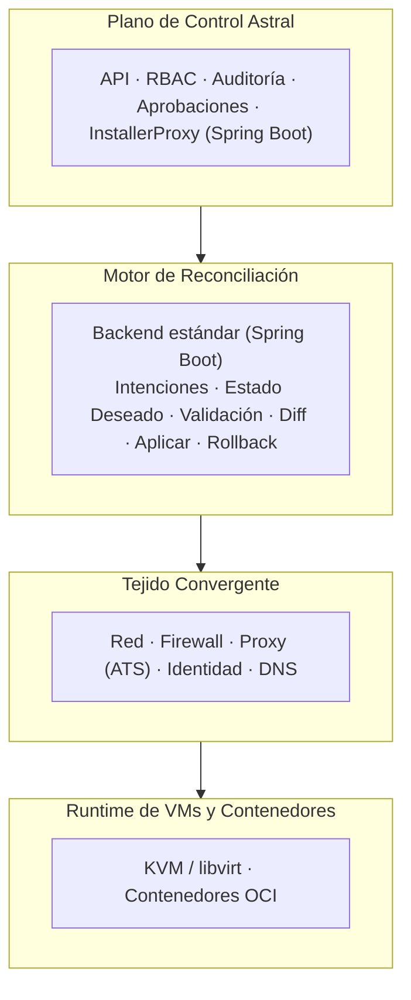
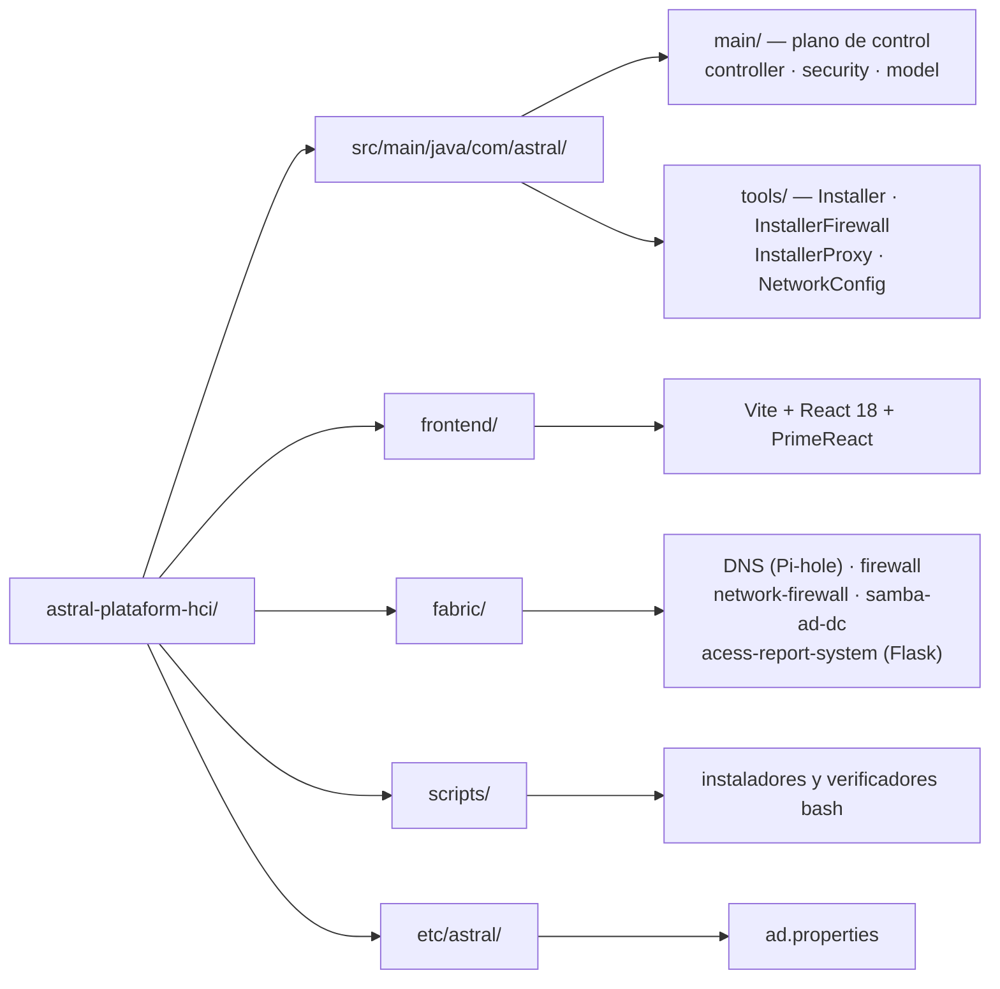

# Astral Platform & HCI


**Infraestructura hiperconvergente (HCI) abierta** — una plataforma de red,
seguridad e identidad orientada por intenciones, que trata cómputo, firewall,
identidad y DNS como primitivos de infraestructura de primera clase, y no como
servicios auxiliares.

Astral unifica máquinas virtuales y contenedores en un único tejido convergente,
gobernado por un plano de control auditable, con intenciones explícitas,
aprobación humana y rollback.

Este proyecto está bajo **GNU AGPL v3**. Consulta [`LICENSE.md`](../../LICENSE.md)
y las dependencias de terceros en [`NOTICE.md`](../../NOTICE.md).

## 🌐 Elige tu idioma / Choose your language

| | Idioma | Documentación |
|---|--------|---------------|
| 🇧🇷 | **Português (Brasil)** | [README.pt-BR.md](README.pt-BR.md) |
| 🇺🇸 | **English** | [README.en-US.md](README.en-US.md) |
| 🇪🇸 | **Español** | [README.es-ES.md](README.es-ES.md) |
| 🇫🇷 | **Français** | [README.fr-FR.md](README.fr-FR.md) |

---

## 📋 Índice

- [🧭 Resumen](#-resumen)
- [❌ El problema](#-el-problema)
- [💡 Filosofía de diseño](#-filosofía-de-diseño)
- [🌟 Qué hace diferente a Astral](#-qué-hace-diferente-a-astral)
- [🏗 Arquitectura](#-arquitectura)
- [🔐 Seguridad e identidad](#-seguridad-e-identidad)
- [🔄 El ciclo de intención](#-el-ciclo-de-intención)
- [📊 Observabilidad](#-observabilidad)
- [🖥 Modelo operativo](#-modelo-operativo)
- [⚠️ Modos de falla y operación degradada](#-modos-de-falla-y-operación-degradada)
- [🎯 Alcance](#-alcance)
- [🚫 No-objetivos](#-no-objetivos)
- [🗂 Estructura del repositorio](#-estructura-del-repositorio)
- [🚀 Instalación](#-instalación)
- [🧪 Compilación](#-compilación)
- [📅 Estado y hoja de ruta](#-estado-y-hoja-de-ruta)
- [🛰 Integración con CELESTE](#-integración-con-celeste)
- [❤️ Apoya el proyecto](#-apoya-el-proyecto)
- [📄 Licencia](#-licencia)

---

## 🧭 Resumen

Astral Platform & HCI (también referido como **Astral HCI-NGFW**) es una
plataforma de infraestructura hiperconvergente abierta, auditable y orientada
por intenciones.

Unifica cómputo (máquinas virtuales y contenedores), red, firewall, identidad y
DNS en un **único tejido convergente**, gobernado por un motor de reconciliación
determinista y operado mediante intenciones explícitas, aprobaciones y rollback.

Cada nodo es independiente o forma parte de un clúster.

## ❌ El problema

Las plataformas modernas sufren problemas estructurales recurrentes:

- **Complejidad artificial** introducida por productos en capas
- **Lock-in de proveedores** disfrazado de "recursos corporativos"
- **Certificaciones caras** usadas como barreras operativas
- **Planos de control opacos** y frágiles

Red, firewall, identidad y cómputo se tratan como silos separados, lo que aumenta
el riesgo operativo y la carga cognitiva. Astral resuelve esto colapsando los
silos en un único plano de control autoritativo y totalmente observable.

## 💡 Filosofía de diseño

Principios innegociables:

- **Determinismo** sobre magia
- **Auditabilidad** sobre conveniencia
- **Fallback** sobre dependencia
- **Autoridad humana** sobre automatización

## 🌟 Qué hace diferente a Astral

No es un hipervisor con complementos, sino un **sistema operativo de
infraestructura**:

- Red, firewall, identidad y DNS forman un dominio convergente
- Las máquinas virtuales y los contenedores consumen el mismo tejido
- Todo cambio sigue el ciclo `intención → reconciliar → commit`
- El **rollback es obligatorio**, no opcional

## 🏗 Arquitectura



### 📦 Componentes

| Capa | Tecnología | Ubicación |
|---|---|---|
| Plano de control | Spring Boot 3.3.5 / Java 21 | `src/main/java/com/astral/main/` |
| Herramientas de instalación | Java 21 | `src/main/java/com/astral/tools/` |
| Frontend | Vite + React 18 + PrimeReact | `frontend/` |
| DNS | Pi-hole | `fabric/DNS/` |
| Firewall | Módulo Java (14 entidades JPA) | `fabric/firewall/` |
| Firewall de red | Python | `fabric/network-firewall/` |
| Controlador de dominio AD | Samba AD multi-distro | `fabric/samba-ad-dc/` |
| Reportes de acceso | Flask + PostgreSQL | `fabric/acess-report-system/` |
| Proxy de autenticación | Apache Traffic Server | `scripts/configure-ats-auth.sh` |
| Telemetría histórica | Elasticsearch | `installbase.sh` |

### 💾 Persistencia

- **Base de datos relacional** para el estado autoritativo (PostgreSQL)
- **Data lake** para telemetría histórica (Elasticsearch)

> ⚠️ `spring.jpa.hibernate.ddl-auto` es `none` **a propósito**. El dueño del
> esquema de la base `astral` es el módulo `astral-firewall`; este módulo no
> ejecuta Flyway deliberadamente, porque dos procesos migrando la misma base
> compiten por la misma tabla de historial. El plano de control nunca altera el
> esquema sin una migración explícita.

### 🖧 Tejido convergente

- Interfaces de red, VLAN, firewall, NAT
- Control de acceso basado en identidad
- DNS con políticas

### 💽 Cómputo y contenedores

- Soporte para **KVM/libvirt** (QEMU) y contenedores OCI
- Ambos obedecen las mismas reglas de firewall e identidad

> ℹ La base de KVM/libvirt la instala `installbase.sh` (fase 15/16). El módulo
> de orquestación de máquinas virtuales está en construcción — consulta
> [Estado](#-estado-y-hoja-de-ruta).

## 🔐 Seguridad e identidad

La autenticación es **multiorigen**: PostgreSQL y Active Directory, combinadas
por `MultiSourceAuthenticationProvider`. Apache Traffic Server delega la
autenticación a Astral mediante el módulo `authproxy.so`.

| Medida | Implementación |
|---|---|
| **Autenticación** | Spring Security + LDAP/Kerberos + PostgreSQL |
| **Cookie de sesión** | `HttpOnly`, `SameSite=Lax`, `Secure` vía `ASTRAL_COOKIE_SECURE` |
| **Expiración de sesión** | 8 horas |
| **Secretos** | `auth.env` en disco, **fuera** del control de versiones |
| **Base de datos** | `ddl-auto=none`, sin cambios automáticos de esquema |
| **Autorización** | RBAC con aprobación humana en el plano de control |
| **Auditoría** | Trilha de auditoría en el plano de control |

> ℹ **El proyecto no usa JWT.** La sesión es con estado y se mantiene en el
> servidor. La cabecera de proxy confiable está habilitada
> (`server.forward-headers-strategy=framework`), algo necesario porque ATS y
> Nginx terminan TLS delante.

Si encuentras una vulnerabilidad, **no abras un issue público**. Consulta
[`SECURITY.md`](../../SECURITY.md).

## 🔄 El ciclo de intención

1. **Creación de la intención** — se declara el estado deseado
2. **Autorización** — un humano aprueba
3. **Reconciliación** — el motor compara lo deseado con lo observado
4. **Validación** — se comprueban los invariantes
5. **Commit o rollback** — la decisión queda registrada
6. **Observación y auditoría** — el resultado es verificable

## 📊 Observabilidad

- Red, firewall, DNS, identidad, máquinas virtuales y contenedores
- **Detección de drift** continua
- Telemetría histórica en Elasticsearch

## 🖥 Modelo operativo

Astral está diseñado para operarse **sin interfaz gráfica**.

Métodos principales de interacción:

- Herramientas de CLI
- Archivos de intención declarativos
- Automatización vía API

## ⚠️ Modos de falla y operación degradada

Astral se degrada de forma segura:

| Falla | Comportamiento |
|---|---|
| API no disponible | No se aplica ningún cambio; el runtime continúa |
| Motor de reconciliación detenido | Permanece el último estado confirmado |
| Base de datos no disponible | Configuración congelada; las cargas siguen |
| Sistemas externos no disponibles | Solo se desactivan las sugerencias |

**La operación manual siempre sigue siendo posible.**

## 🎯 Alcance

Astral se enfoca en:

- Cómputo (máquinas virtuales y contenedores)
- Red, firewall y enrutamiento
- Identidad y DNS
- Auditoría y observabilidad

## 🚫 No-objetivos

Para preservar la estabilidad, Astral evita:

- Automatización oculta
- Infraestructura auto-modificable
- Auto-remediación sin aprobación
- Configuración mediante UI

Astral **no es** un PaaS, **no es** Kubernetes y **no es** una abstracción de
nube.

## 🗂 Estructura del repositorio



```
astral-plataform-hci/
├── src/main/java/com/astral/
│   ├── main/              # plano de control
│   │   ├── controller/    # Login, Home, SPA forward, firewall proxy, cert download
│   │   ├── security/      # MultiSourceAuthenticationProvider, SecurityConfig
│   │   │                  # ProxyAuthorizationServer, AstralPrincipal
│   │   └── model/
│   └── tools/             # Installer, InstallerFirewall, InstallerProxy,
│                          # NetworkConfig, Uninstaller
├── src/main/resources/    # application.properties + UI estática heredada
├── frontend/              # Vite + React 18 + PrimeReact (la compilación va a
│                          # src/main/resources/static/app/)
├── fabric/
│   ├── DNS/               # Pi-hole
│   ├── firewall/          # módulo Java con 14 entidades JPA
│   ├── network-firewall/  # Python
│   ├── samba-ad-dc/       # Samba AD DC (Arch, Debian 13, Fedora)
│   ├── acess-report-system/  # Flask + PostgreSQL
│   └── frontend/          # UI heredada servida por el proxy
├── scripts/               # instaladores y verificadores bash
├── etc/astral/            # ad.properties
├── installbase.sh         # instalador de dependencias del sistema
├── projectupdates.md      # documento vivo: razonamiento y línea de tiempo
└── pom.xml
```

## 🚀 Instalación

Astral tiene **un solo instalador**, en bash puro. Instala directamente y no
llama ni a Python ni a Java.

### 1⃣ Dependencias del sistema

```bash
git clone https://github.com/euripedesdark/astral-plataform-hci.git
cd astral-plataform-hci
sudo ./installbase.sh
```

Detecta la distribución (Debian/Ubuntu, RHEL/Fedora/CentOS/Rocky, Arch) e instala
en 16 fases: PostgreSQL, iptables e ipset, Node.js, Java 21 LTS, Maven, fuentes
Orbitron, Apache Traffic Server, Samba (cliente y Kerberos), Pi-hole,
Elasticsearch, QEMU/KVM/libvirt y ClamAV.

### 2⃣ Compilación

```bash
# Frontend PrimeReact
cd frontend && npm install && npm run build && cd ..

# Backend Spring Boot
mvn -B -DskipTests package
```

### 3⃣ Instalación

```bash
sudo ./scripts/install-astral.sh --dry-run   # mira lo que se hará
sudo ./scripts/install-astral.sh
```

### 4⃣ Verificación posterior al despliegue

```bash
./scripts/verify-astral.sh
```

El verificador revisa el servicio, el puerto de salud y la interfaz, **y**
valida que el puerto de la aplicación esté ligado al loopback.

### 🔌 Topología de puertos

| Puerto | Bind | Función |
|---|---|---|
| `8081` | loopback | Endpoint de salud (`/actuator/health`) |
| `8082` | loopback | Aplicación (`/app/`) |
| `443` | pública | Entrada vía Nginx, con TLS |

> ⚠️ La aplicación **no debe** escuchar en `0.0.0.0`. Si lo hace, alguien alcanza
> la interfaz sin pasar por TLS — `verify-astral.sh` falla a propósito en ese
> caso.

> 💡 Con TLS delante, sube `ASTRAL_COOKIE_SECURE=true` en
> `/etc/astral/astral.env`, o si no la cookie de sesión viajará en claro.

## 🧪 Compilación

```bash
mvn test                    # pruebas del backend
npm --prefix frontend test 2>/dev/null || true
```

La CI (`.github/workflows/build.yml`) se ejecuta en cada push y PR, con Java 21 y
Node 20.

## 📅 Estado y hoja de ruta

En desarrollo inicial.

| Módulo | Estado |
|---|---|
| Plano de control (API, RBAC, auditoría, aprobaciones) | 🟡 En desarrollo |
| Autenticación multiorigen (AD + PostgreSQL) | 🟢 Funcionando |
| DNS con Pi-hole | 🟢 Funcionando |
| Samba AD DC multi-distro | 🟢 Funcionando |
| Firewall y proxy ATS | 🟢 Funcionando |
| Reportes de acceso (Flask) | 🟢 Funcionando |
| Frontend PrimeReact | 🟡 En desarrollo |
| Cómputo (KVM/libvirt) | 🟡 Base instalada; orquestación en construcción |
| Motor de reconciliación completo | 🟡 Contratos e intenciones en construcción |
| **Replicación de almacenamiento (DRBD)** | 🔴 **Planeado — no implementado** |

> ℹ La replicación de almacenamiento aparece en versiones anteriores de este
> README como funcionalidad. **No existe en el código**: el único lugar donde
> aparecía la palabra era este archivo. Por honestidad, está marcada como
> planeada.

Foco actual:

- Contratos del plano de control
- Definición del esquema de intenciones
- Fundamentos del motor de reconciliación
- Red y firewall deterministas

### 🗓 Línea de tiempo

[`projectupdates.md`](../../projectupdates.md) es el **documento vivo** del
proyecto (versión 1.4), con el razonamiento de cada decisión y el historial:

| Fecha | Versión | Hito |
|---|---|---|
| 18 dic 2025 | v0.1 | Migración a PostgreSQL; distro objetivo especificada |
| 20 dic 2025 | v1.0 | Documento de referencia central; hoja de ruta consolidada |
| 02 ene 2026 | v1.2 | Clasificación de DNS sensible al contexto (offline, CSV, sin API en vivo) |
| 27 ago 2026 | v1.3 | Scripts multi-distro del Samba AD; instalador web unificado |
| 02 sep 2026 | v1.4 | Instalador único en bash; decisión de arquitectura registrada |

## 🛰 Integración con CELESTE

CELESTE es un **proyecto independiente**:

- Sin dependencia ni compartir el plano de control
- Interacción únicamente mediante APIs explícitas

## 🧾 Declaración final

Astral no está construido para seguir tendencias. Está construido para:

- Ser comprendido
- Ser auditado
- Ser operado bajo presión
- Sobrevivir a fallas de componentes
- Permanecer libre y defendible

Astral es infraestructura para ingenieros que valorizan el control sobre la
comodidad.

## ❤️ Apoya el proyecto

Astral Platform & HCI es una plataforma de infraestructura libre, mantenida por
un único desarrollador.

Si este proyecto te ayudó, a tu empresa o a tu equipo, considera apoyar su
desarrollo.

**PIX:** `24adc62c-b073-4587-974d-03fe35f6733f`

### 💳 Transferencia internacional (Wise)

La clave PIX no funciona fuera de Brasil.

**Si envías desde un banco de Estados Unidos**, puedes usar estos datos para una
transferencia doméstica. **Si envías desde algún otro lugar**, haz una
transferencia internacional Swift.

| | |
|---|---|
| **Nombre** | Euripedes Batista de Paiva Junior |
| **Tipo de cuenta** | Checking |
| **Routing number** (para transferencias wire y ACH) | `101019628` |
| **Número de cuenta** | `215822927677` |
| **Nombre y dirección del banco** | Wise US Inc, 108 W 13th St, Wilmington, DE, 19801, United States |
| **SWIFT/BIC** | `TRWIUS35XXX` |

Datos completos en cuatro idiomas: [`DONATE.md`](../../DONATE.md) ·
🇧🇷 [PT](../../DONATE.md#-português) ·
🇺🇸 [EN](../../DONATE.md#-english) ·
🇪🇸 [ES](../../DONATE.md#-español) ·
🇫🇷 [FR](../../DONATE.md#-français)

## 📄 Licencia

**GNU Affero General Public License v3.0 (AGPLv3).** El texto completo e
inalterado está en [`LICENSE.md`](../../LICENSE.md).

La AGPLv3 exige que el código fuente se ofrezca a quien usa el programa,
incluso cuando el uso es **por red** — de ahí el "Affero". Para un plano de
control al que se accede por navegador, esa cláusula es justamente la que
importa: quien apunte su navegador a este sistema tiene derecho al código.

Las dependencias de terceros las instala el sistema operativo o se resuelven en
la compilación, y **conservan sus propias licencias**. La sección *Servicios
separados* del [`NOTICE.md`](../../NOTICE.md) lista lo que **no** es AGPLv3 — en
particular el servidor Graylog, que es SSPL y no se redistribuye aquí.

© 2026 Astral Platform & HCI — **Creado por: Euripedes Batista de Paiva Junior**