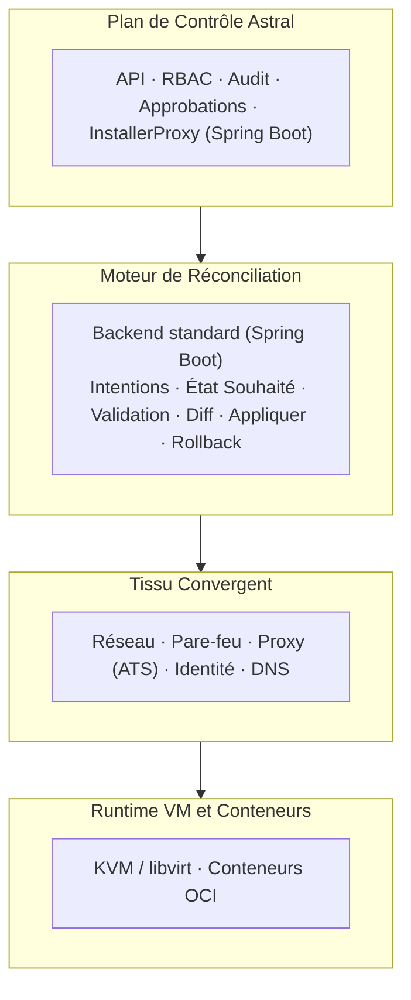
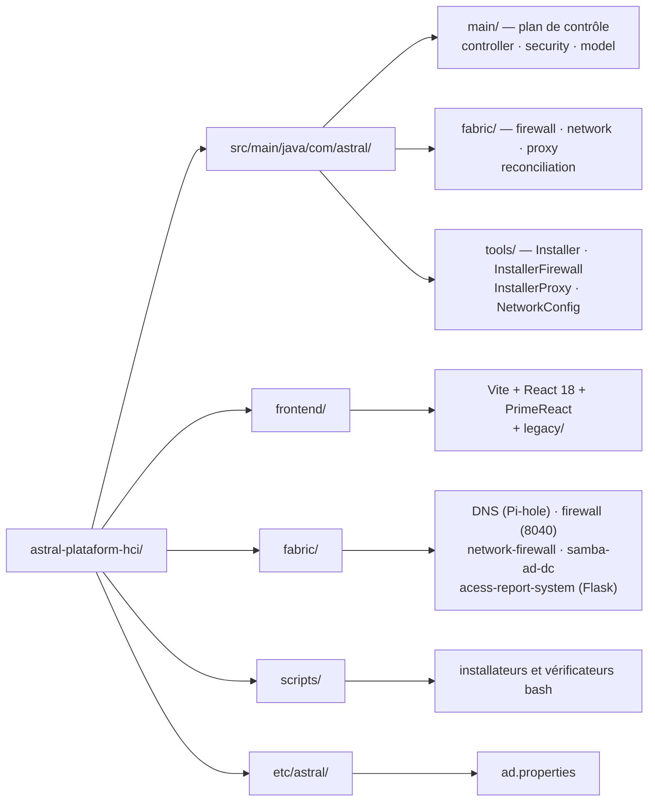

# Astral Platform & HCI


**Infrastructure hyperconvergée (HCI) ouverte** — une plateforme de réseau, de
sécurité et d'identité guidée par les intentions, qui traite le calcul, le
pare-feu, l'identité et le DNS comme des primitives d'infrastructure de premier
plan, et non comme des services auxiliaires.

Astral unifie les machines virtuelles et les conteneurs dans un seul tissu
convergent, gouverné par un plan de contrôle auditable, avec des intentions
explicites, une approbation humaine et un rollback.

Ce projet est sous **GNU AGPL v3**. Voir [`LICENSE.md`](../../LICENSE.md), et
les dépendances tierces dans [`NOTICE.md`](../../NOTICE.md).

## 🌐 Choisissez votre langue / Choose your language

| | Langue | Documentation |
|---|--------|---------------|
| 🇧🇷 | **Português (Brasil)** | [README.pt-BR.md](README.pt-BR.md) |
| 🇺🇸 | **English** | [README.en-US.md](README.en-US.md) |
| 🇪🇸 | **Español** | [README.es-ES.md](README.es-ES.md) |
| 🇫🇷 | **Français** | [README.fr-FR.md](README.fr-FR.md) |

---

## 📋 Sommaire

- [🧭 Résumé](#-résumé)
- [❌ Le problème](#-le-problème)
- [💡 Philosophie de conception](#-philosophie-de-conception)
- [🌟 Ce qui distingue Astral](#-ce-qui-distingue-astral)
- [🏗 Architecture](#-architecture)
- [🔐 Sécurité et identité](#-sécurité-et-identité)
- [🔄 Le cycle d'intention](#-le-cycle-dintention)
- [📊 Observabilité](#-observabilité)
- [🖥 Modèle opérationnel](#-modèle-opérationnel)
- [⚠️ Modes de défaillance et fonctionnement dégradé](#-modes-de-défaillance-et-fonctionnement-dégradé)
- [🎯 Périmètre](#-périmètre)
- [🚫 Non-objectifs](#-non-objectifs)
- [🗂 Structure du dépôt](#-structure-du-dépôt)
- [🚀 Installation](#-installation)
- [🧪 Compilation](#-compilation)
- [📅 État et feuille de route](#-état-et-feuille-de-route)
- [🛰 Intégration avec CELESTE](#-intégration-avec-celeste)
- [❤️ Soutenir le projet](#-soutenir-le-projet)
- [📄 Licence](#-licence)

---

## 🧭 Résumé

Astral Platform & HCI (également appelé **Astral HCI-NGFW**) est une plateforme
d'infrastructure hyperconvergée ouverte, auditable et guidée par les intentions.

Elle unifie le calcul (machines virtuelles et conteneurs), le réseau, le
pare-feu, l'identité et le DNS dans un **unique tissu convergent**, gouverné par
un moteur de réconciliation déterministe et opéré par des intentions
explicites, des approbations et un rollback.

Chaque nœud est autonome ou fait partie d'un cluster.

## ❌ Le problème

Les plateformes modernes souffrent de problèmes structurels récurrents :

- **Complexité artificielle** introduite par des produits empilés
- **Verrouillage fournisseur** déguisé en « fonctionnalités d'entreprise »
- **Certifications coûteuses** utilisées comme barrières opérationnelles
- **Plans de contrôle opaques** et fragiles

Réseau, pare-feu, identité et calcul sont traités comme des silos séparés, ce
qui augmente le risque opérationnel et la charge cognitive. Astral résout cela
en faisant s'effondrer les silos dans un plan de contrôle unique, faisant
autorité et entièrement observable.

## 💡 Philosophie de conception

Principes non négociables :

- **Déterminisme** plutôt que magie
- **Auditabilité** plutôt que commodité
- **Repli** plutôt que dépendance
- **Autorité humaine** plutôt qu'automatisation

## 🌟 Ce qui distingue Astral

Ce n'est pas un hyperviseur avec des greffons, mais un **système d'exploitation
d'infrastructure** :

- Réseau, pare-feu, identité et DNS forment un domaine convergent
- Les machines virtuelles et les conteneurs consomment le même tissu
- Chaque changement suit le cycle `intention → réconcilier → commit`
- Le **rollback est obligatoire**, pas optionnel

## 🏗 Architecture



### 📦 Composants

| Couche | Technologie | Emplacement |
|---|---|---|
| Plan de contrôle | Spring Boot 3.3.5 / Java 21 | `src/main/java/com/astral/main/` |
| Outils d'installation | Java 21 | `src/main/java/com/astral/tools/` |
| Frontend | Vite + React 18 + PrimeReact | `frontend/` |
| DNS | Pi-hole | `fabric/DNS/` |
| Pare-feu (hérité, retiré) | Application Java séparée (14 entités JPA, port 8040) | `fabric/firewall/` |
| Pare-feu dans la plateforme | Copie des mêmes 14 entités, pas encore déployée | `src/main/java/com/astral/fabric/firewall/` |
| Pare-feu réseau | Python | `fabric/network-firewall/` |
| Contrôleur de domaine AD | Samba AD multi-distribution | `fabric/samba-ad-dc/` |
| Rapports d'accès | Flask + PostgreSQL | `fabric/acess-report-system/` |
| Proxy d'authentification | Apache Traffic Server | `scripts/configure-ats-auth.sh` |
| Télémétrie historique | Elasticsearch | `installbase.sh` |
| File de réconciliation | RabbitMQ (intents) | `fabric/reconciliation/` |
| Cache ACL | Redis | `fabric/proxy/` |
| Métriques historiques | TimescaleDB (hypertables, 30 jours) | `scripts/configure-timescaledb.sh` |
| Contrat d'API | OpenAPI/Swagger 3 | `/v3/api-docs`, `/swagger-ui/` |

### 💾 Persistance

- **Base relationnelle** pour l'état faisant autorité (PostgreSQL)
- **Data lake** pour la télémétrie historique (Elasticsearch)

> ⚠️ `spring.jpa.hibernate.ddl-auto` vaut `validate` et **Flyway est activé**.
> La migration versionnée se trouve dans `src/main/resources/db/migration/` :
> `V1` est la ligne de base de l'état qui existait déjà et `V100` est le premier
> vrai changement suivant. `validate` fait **échouer** le démarrage si la base
> ne correspond pas au Java — l'inverse de `none`/`update`, qui masquent la
> divergence jusqu'à ce qu'elle devienne un bug en production.
>
> ⚠️ L'application héritée `fabric/firewall/` (port 8040) est **retirée mais toujours
> dans le dépôt**, avec son propre `pom.xml` et les mêmes 14 entités — et elle
> valide aussi avec Flyway. `InstallerFirewall.java` la déploie toujours, mais
> plus rien dans l'application principale ne lit `astral.firewall.url`, et le
> service ne répond pas. C'est la migration vers
> `src/main/java/com/astral/fabric/` qui la supprimera.

### 🖧 Tissu convergent

- Interfaces réseau, VLAN, pare-feu, NAT
- Contrôle d'accès fondé sur l'identité
- DNS avec politiques

### 💽 Calcul et conteneurs

- Prise en charge de **KVM/libvirt** (QEMU) et des conteneurs OCI
- Les deux obéissent aux mêmes règles de pare-feu et d'identité

> ℹ La base KVM/libvirt est installée par `installbase.sh` (phase 15/16). Le
> module d'orchestration des machines virtuelles est en construction — voir
> [État](#-état-et-feuille-de-route).

## 🔐 Sécurité et identité

L'authentification est **multi-source** : PostgreSQL et Active Directory,
combinées par `MultiSourceAuthenticationProvider`. Apache Traffic Server délègue
l'authentification à Astral via le module `authproxy.so`.

| Mesure | Implémentation |
|---|---|
| **Authentification** | Spring Security + LDAP/Kerberos + PostgreSQL |
| **Cookie de session** | `HttpOnly`, `SameSite=Lax`, `Secure` via `ASTRAL_COOKIE_SECURE` |
| **Expiration de session** | 8 heures |
| **Secrets** | `auth.env` sur disque, **hors** gestion de versions |
| **Base de données** | `ddl-auto=validate` + Flyway (`db/migration/`) |
| **Autorisation** | RBAC avec approbation humaine dans le plan de contrôle |
| **Audit** | Piste d'audit dans le plan de contrôle |

> ℹ L'UI et le moteur d'ACL utilisent une **session avec état** sur le serveur,
> avec un cookie `HttpOnly`. `/api/v1/acl/check` **accepte** un Bearer JWT HS256
> du BrasilCloud Auth Service, mais la validation est **désactivée par défaut**
> (`ASTRAL_AUTH_JWT_ENABLED=false`) : le Auth Service n'émet pas encore de jetons,
> donc le chemin qui fonctionne est la session. Contrat complet dans le
> [guide d'intégration](../GUIA-INTEGRACAO-AUTH-SERVICE.md) (PT-BR). L'en-tête de
> proxy de confiance est activé
> (`server.forward-headers-strategy=framework`), ce qui est nécessaire car ATS et
> Nginx terminent le TLS en amont.

Si vous trouvez une faille, **n'ouvrez pas de ticket public**. Voir
[`SECURITY.md`](../../SECURITY.md).

## 🔄 Le cycle d'intention

1. **Création de l'intention** — l'état souhaité est déclaré
2. **Autorisation** — un humain approuve
3. **Réconciliation** — le moteur compare souhaité et observé
4. **Validation** — les invariants sont vérifiés
5. **Commit ou rollback** — la décision est enregistrée
6. **Observation et audit** — le résultat est vérifiable

## 📊 Observabilité

- Réseau, pare-feu, DNS, identité, machines virtuelles et conteneurs
- **Détection de dérive** continue
- Télémétrie historique dans Elasticsearch

## 🖥 Modèle opérationnel

Astral est conçu pour être opéré **sans interface graphique**.

Principaux modes d'interaction :

- Outils CLI
- Fichiers d'intention déclaratifs
- Automatisation via API

## ⚠️ Modes de défaillance et fonctionnement dégradé

Astral se dégrade en sécurité :

| Défaillance | Comportement |
|---|---|
| API indisponible | Aucun changement appliqué ; le runtime continue |
| Moteur de réconciliation arrêté | Le dernier état validé reste en place |
| Base de données indisponible | Configuration gelée ; les charges continuent |
| Systèmes externes indisponibles | Seules les suggestions sont désactivées |

**L'opération manuelle reste toujours possible.**

## 🎯 Périmètre

Astral se concentre sur :

- Calcul (machines virtuelles et conteneurs)
- Réseau, pare-feu et routage
- Identité et DNS
- Audit et observabilité

## 🚫 Non-objectifs

Pour préserver la stabilité, Astral évite :

- Automatisation cachée
- Infrastructure auto-modifiable
- Auto-remédiation sans approbation
- Configuration par interface graphique

Astral **n'est pas** un PaaS, **n'est pas** Kubernetes et **n'est pas** une
abstraction cloud.

## 🗂 Structure du dépôt



```
astral-plataform-hci/
├── src/main/java/com/astral/
│   ├── main/              # plan de contrôle
│   │   ├── controller/    # Login, Home, SPA forward, cert download
│   │   ├── security/      # MultiSourceAuthenticationProvider, SecurityConfig
│   │   │                  # ProxyAuthorizationServer, AstralPrincipal
│   │   └── model/
│   ├── fabric/            # le tissu, en cours de migration dans l'application
│   │   ├── firewall/      # copie des 14 entités, API et WebSocket
│   │   ├── network/       # adressage et interfaces
│   │   ├── proxy/         # ACL, audit, cache Redis
│   │   └── reconciliation/ # Intent → Validation → Diff → Commit → Rollback
│   └── tools/             # Installer, InstallerFirewall, InstallerProxy,
│                          # NetworkConfig, Uninstaller
├── src/main/resources/    # application.properties, db/migration (Flyway),
│                          # data/nameservers.csv
├── frontend/              # Vite + React 18 + PrimeReact (la compilation va dans
│                          # src/main/resources/static/app/)
│   └── legacy/            # UI héritée servie par le proxy
├── fabric/                # scripts, services et l'application héritée
│   ├── DNS/               # Pi-hole
│   ├── firewall/          # application Java séparée (14 entités, port 8040)
│   ├── network-firewall/  # Python
│   ├── samba-ad-dc/       # Samba AD DC (Arch, Debian 13, Fedora)
│   ├── acess-report-system/  # Flask + PostgreSQL
│   └── frontend/          # UI héritée (en cours de migration vers frontend/legacy/)
├── scripts/               # installateurs et vérificateurs bash
├── etc/astral/            # ad.properties
├── installbase.sh         # installateur de dépendances système
├── projectupdates.md      # document vivant : justification et chronologie
└── pom.xml
```

## 🚀 Installation

Astral n'a **qu'un seul installateur**, en bash pur. Il installe directement et
n'appelle ni Python ni Java.

### 1⃣ Dépendances système

```bash
git clone https://github.com/euripedesdark/astral-plataform-hci.git
cd astral-plataform-hci
sudo ./installbase.sh
```

Il détecte la distribution (Debian/Ubuntu, RHEL/Fedora/CentOS/Rocky, Arch) et
installe en 16 phases : PostgreSQL, iptables et ipset, Node.js, Java 21 LTS,
Maven, polices Orbitron, Apache Traffic Server, Samba (client et Kerberos),
Pi-hole, Elasticsearch, QEMU/KVM/libvirt et ClamAV.

### 2⃣ Compilation

```bash
# Frontend PrimeReact
cd frontend && npm install && npm run build && cd ..

# Backend Spring Boot
mvn -B -DskipTests package
```

### 3⃣ Installation

```bash
sudo ./scripts/install-astral.sh --dry-run   # voyez ce qui sera fait
sudo ./scripts/install-astral.sh
```

### 4⃣ Vérification après déploiement

```bash
./scripts/verify-astral.sh
```

Le vérificateur contrôle le service, le port de santé et l'interface, **et**
valide que le port de l'application est lié à la boucle locale.

### 🔌 Topologie des ports

| Port | Bind | Rôle |
|---|---|---|
| `8081` | boucle locale | Point de terminaison santé (`/actuator/health`) |
| `8082` | boucle locale | Application (`/app/`) |
| `443` | publique | Entrée via Nginx, avec TLS |
| `81` | publique | `301` vers 443, pour que personne ne reste bloqué sur l'ancien port |
| `8040` | — | Application par-feu héritée, **retirée** : le service ne répond pas et plus rien ne la consomme |

> ⚠️ L'application **ne doit pas** écouter sur `0.0.0.0`. Si c'est le cas,
> quelqu'un atteint l'interface sans passer par le TLS — `verify-astral.sh`
> échoue volontairement dans ce cas.

> 💡 Avec du TLS en amont, définissez `ASTRAL_COOKIE_SECURE=true` dans
> `/etc/astral/astral.env`, sinon le cookie de session circule en clair.

## 🧪 Compilation

```bash
mvn test                    # tests du backend
npm --prefix frontend test 2>/dev/null || true
```

La CI (`.github/workflows/build.yml`) s'exécute à chaque push et PR, avec Java 21
et Node 20.

## 📅 État et feuille de route

En développement initial.

| Module | État |
|---|---|
| Plan de contrôle (API, RBAC, audit, approbations) | 🟡 En développement |
| Authentification multi-source (AD + PostgreSQL) | 🟢 Fonctionnel |
| DNS avec Pi-hole | 🟢 Fonctionnel |
| Samba AD DC multi-distribution | 🟢 Fonctionnel |
| Pare-feu et proxy ATS | 🟢 Fonctionnel |
| Rapports d'accès (Flask) | 🟢 Fonctionnel |
| Frontend PrimeReact | 🟡 En développement |
| Calcul (KVM/libvirt) | 🟡 Base installée ; orchestration en construction |
| Moteur de réconciliation (Intent → Validation → Diff → Commit → Rollback) | 🟡 Implémenté, en cours d'intégration |
| Migration du pare-feu dans la plateforme (retrait de l'app 8040) | 🟡 En cours |
| **Réplication de stockage (DRBD)** | 🔴 **Planifié — non implémenté** |

> ℹ La réplication de stockage apparaît dans les versions précédentes de ce
> README comme une fonctionnalité. Elle **n'existe pas dans le code** : le seul
> endroit où le terme figurait était ce fichier. Par honnêteté, elle est marquée
> comme planifiée.

Focus actuel :

- Supprimer l'application héritée `fabric/firewall/` (8040) et le
  `InstallerFirewall.java` qui la déploie
- Terminer la migration de l'UI héritée vers
  `frontend/legacy/`
- Élargir le `Diff` du réconciliateur aux ressources qu'il ne couvre pas
  encore
- Pousser le proxy ATS au-delà de `/api/v1/acl/check`

### 🗓 Chronologie

[`projectupdates.md`](../../projectupdates.md) est le **document vivant** du
projet (version 1.4), avec la justification de chaque décision et l'historique :

| Date | Version | Jalon |
|---|---|---|
| 18 déc 2025 | v0.1 | Migration PostgreSQL ; distribution cible spécifiée |
| 20 déc 2025 | v1.0 | Document de référence central ; feuille de route consolidée |
| 02 janv 2026 | v1.2 | Classification DNS sensible au contexte (hors ligne, CSV, sans API en direct) |
| 27 août 2026 | v1.3 | Scripts Samba AD multi-distribution ; installateur web unifié |
| 02 sept 2026 | v1.4 | Installateur bash unique ; décision d'architecture consignée |

## 🛰 Intégration avec CELESTE

CELESTE est un **projet indépendant** :

- Sans dépendance ni partage de plan de contrôle
- Interaction uniquement via des API explicites

## 🧾 Déclaration finale

Astral n'est pas construit pour suivre les tendances. Il est construit pour :

- Être compris
- Être audité
- Être opéré sous pression
- Survivre aux défaillances de composants
- Rester libre et défendable

Astral est une infrastructure pour les ingénieurs qui privilégient le contrôle
sur la commodité.

## ❤️ Soutenir le projet

Astral Platform & HCI est une plateforme d'infrastructure libre, maintenue par
un seul développeur.

Si ce projet vous a aidé, vous, votre entreprise ou votre équipe, envisagez de
soutenir son développement.

**PIX :** `24adc62c-b073-4587-974d-03fe35f6733f`

### 💳 Virement international (Wise)

La clé PIX ne fonctionne pas hors du Brésil.

**Si vous envoyez depuis une banque aux États-Unis**, vous pouvez utiliser ces
coordonnées pour un virement domestique. **Si vous envoyez depuis un autre
endroit**, faites un virement international Swift.

| | |
|---|---|
| **Nom** | Euripedes Batista de Paiva Junior |
| **Type de compte** | Checking |
| **Routing number** (pour les virements wire et ACH) | `101019628` |
| **Numéro de compte** | `215822927677` |
| **Nom et adresse de la banque** | Wise US Inc, 108 W 13th St, Wilmington, DE, 19801, United States |
| **SWIFT/BIC** | `TRWIUS35XXX` |

Coordonnées complètes en quatre langues : [`DONATE.md`](../../DONATE.md) ·
🇧🇷 [PT](../../DONATE.md#-português) ·
🇺🇸 [EN](../../DONATE.md#-english) ·
🇪🇸 [ES](../../DONATE.md#-español) ·
🇫🇷 [FR](../../DONATE.md#-français)

## 📄 Licence

**GNU Affero General Public License v3.0 (AGPLv3).** Le texte complet et
inalteré se trouve dans [`LICENSE.md`](../../LICENSE.md).

L'AGPLv3 exige que le code source soit proposé à quiconque utilise le programme,
y compris lorsque l'usage se fait **par le réseau** — d'où l'« Affero ». Pour un
plan de contrôle accessible par navigateur, c'est précisément cette clause qui
compte : quiconque pointe son navigateur vers ce système a droit au code.

Les dépendances tierces sont installées par le système d'exploitation ou
résolues à la compilation, et **conservent leurs propres licences**. La section
*Services séparés* du [`NOTICE.md`](../../NOTICE.md) liste ce qui **n'est pas**
AGPLv3 — en particulier le serveur Graylog, qui est SSPL et n'est pas
redistribué ici.

© 2026 Astral Platform & HCI — **Créé par : Euripedes Batista de Paiva Junior**