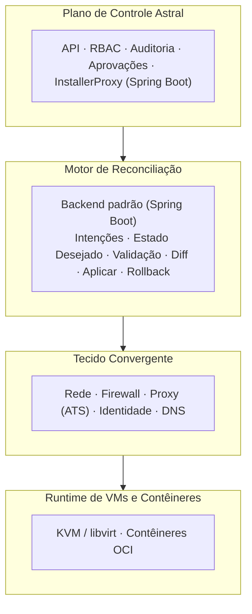
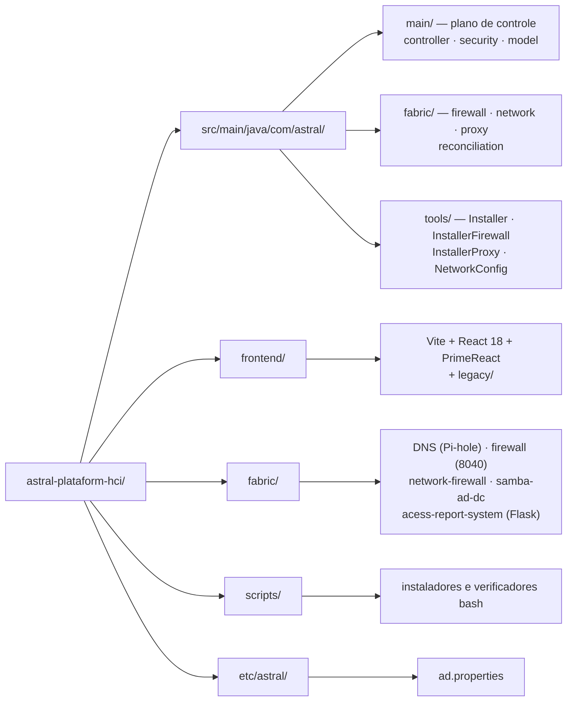

# Astral Platform & HCI


**Infraestrutura Hiperconvergente (HCI) aberta** — plataforma de rede,
segurança e identidade orientada por intenções, que trata computação,
firewall, identidade e DNS como primitivos de infraestrutura de primeira
classe, e não como serviços auxiliares.

Astral unifica VMs e contêineres em um único tecido convergente, governado por
um plano de controle auditável, com intenções explícitas, aprovação humana e
rollback.

Este projeto está sob **GNU AGPL v3**. Ver [`LICENSE.md`](../../LICENSE.md), e
as dependências de terceiros em [`NOTICE.md`](../../NOTICE.md).

## 🌐 Escolha o seu idioma / Choose your language

| | Idioma | Documentação |
|---|--------|--------------|
| 🇧🇷 | **Português (Brasil)** | [README.pt-BR.md](README.pt-BR.md) |
| 🇺🇸 | **English** | [README.en-US.md](README.en-US.md) |
| 🇪🇸 | **Español** | [README.es-ES.md](README.es-ES.md) |
| 🇫🇷 | **Français** | [README.fr-FR.md](README.fr-FR.md) |

---

## 📋 Índice

- [🧭 Resumo](#-resumo)
- [❌ O problema](#-o-problema)
- [💡 Filosofia de design](#-filosofia-de-design)
- [🌟 O que torna o Astral diferente](#-o-que-torna-o-astral-diferente)
- [🏗 Arquitetura](#-arquitetura)
- [🔐 Segurança e identidade](#-segurança-e-identidade)
- [🔄 O ciclo de intenção](#-o-ciclo-de-intenção)
- [📊 Observabilidade](#-observabilidade)
- [🖥 Modelo operacional](#-modelo-operacional)
- [⚠️ Modos de falha e operação degradada](#-modos-de-falha-e-operação-degradada)
- [🎯 Escopo](#-escopo)
- [🚫 Não-objetivos](#-não-objetivos)
- [🗂 Estrutura do repositório](#-estrutura-do-repositório)
- [🚀 Instalação](#-instalação)
- [🧪 Build](#-build)
- [📅 Status e hoja de ruta](#-status-e-hoja-de-rota)
- [🛰 Integração com CELESTE](#-integração-com-celeste)
- [❤️ Apoie o projeto](#-apoie-o-projeto)
- [📄 Licença](#-licença)

---

## 🧭 Resumo

O Astral Platform & HCI (também referred como **Astral HCI-NGFW**) é uma
plataforma de infraestrutura hiperconvergente aberta, auditável e orientada por
intenções.

Ele unifica computação (VMs e contêineres), rede, firewall, identidade e DNS em
um **único tecido convergente**, governado por um motor de reconciliação
determinístico e operado por intenções explícitas, aprovações e rollback.

Cada nó é independente ou parte de um cluster.

## ❌ O problema

Plataformas modernas sofrem com problemas estruturais recorrentes:

- **Complexidade artificial** introduzida por produtos em camadas
- **Lock-in de fornecedores** disfarçado de "recursos corporativos"
- **Certificações caras** usadas como barreiras operacionais
- **Planos de controle opacos** e frágeis

Rede, firewall, identidade e computação são tratados como silos separados, o
que aumenta o risco operacional e a carga cognitiva. O Astral resolve isso
colapsando os silos em um único plano de controle autoritativo e totalmente
observável.

## 💡 Filosofia de design

Princípios inegociáveis:

- **Determinismo** sobre mágica
- **Auditabilidade** sobre conveniência
- **Fallback** sobre dependência
- **Autoridade humana** sobre automação

## 🌟 O que torna o Astral diferente

Não é um hipervisor com add-ons, mas um **sistema operacional de
infraestrutura**:

- Rede, firewall, identidade e DNS formam um domínio convergente
- VMs e contêineres consomem o mesmo tecido
- Todas as mudanças seguem o ciclo `intenção → reconciliar → commit`
- **Rollback é obrigatório**, não opcional

## 🏗 Arquitetura



### 📦 Componentes

| Camada | Tecnologia | Onde está |
|---|---|---|
| Plano de controle | Spring Boot 3.3.5 / Java 21 | `src/main/java/com/astral/main/` |
| Ferramentas de instalação | Java 21 | `src/main/java/com/astral/tools/` |
| Frontend | Vite + React 18 + PrimeReact | `frontend/` |
| DNS | Pi-hole | `fabric/DNS/` |
| Firewall (legado, aposentado) | App Java à parte (14 entidades JPA, porta 8040) | `fabric/firewall/` |
| Firewall dentro da plataforma | Cópia das mesmas 14 entidades, ainda não implantada | `src/main/java/com/astral/fabric/firewall/` |
| Firewall de rede | Python | `fabric/network-firewall/` |
| Active Directory DC | Samba AD multi-distro | `fabric/samba-ad-dc/` |
| Relatórios de acesso | Flask + PostgreSQL | `fabric/acess-report-system/` |
| Proxy de autenticação | Apache Traffic Server | `scripts/configure-ats-auth.sh` |
| Telemetria histórica | Elasticsearch | `installbase.sh` |
| Fila de reconciliação | RabbitMQ (intents) | `fabric/reconciliation/` |
| Cache de ACL | Redis | `fabric/proxy/` |
| Métricas históricas | TimescaleDB (hypertables, 30 dias) | `scripts/configure-timescaledb.sh` |
| Contrato de API | OpenAPI/Swagger 3 | `/v3/api-docs`, `/swagger-ui/` |

### 💾 Persistência

- **Banco relacional** para o estado autoritativo (PostgreSQL)
- **Data lake** para telemetria histórica (Elasticsearch)

> ⚠️ O `spring.jpa.hibernate.ddl-auto` é `validate` e o **Flyway está ligado**.
> A migração versionada mora em `src/main/resources/db/migration/`: `V1` é a
> linha de base do estado que já existia e `V100` é a primeira mudança real
> depois dela. `validate` faz a subida **falhar** se o banco não bater com o
> Java — o oposto de `none`/`update`, que escondem a divergência até ela virar
> bug em produção.
>
> ⚠️ O app legado `fabric/firewall/` (porta 8040) está **aposentado, mas ainda no
> repositório**, com o próprio `pom.xml` e as mesmas 14 entidades — e ele também
> valida com Flyway. O `InstallerFirewall.java` continua o implantando, mas nada
> na aplicação principal lê mais `astral.firewall.url`, e o serviço não responde.
> É a migração para `src/main/java/com/astral/fabric/` que vai apagá-lo.

### 🖧 Tecido convergente

- Interfaces de rede, VLANs, firewall, NAT
- Controle de acesso baseado em identidade
- DNS com políticas

### 💽 Computação e contêineres

- Suporte a **KVM/libvirt** (QEMU) e a contêineres OCI
- Ambos obedecem às mesmas regras de firewall e identidade

> ℹ A base do KVM/libvirt é instalada pelo `installbase.sh` (fase 15/16). O
> módulo de orquestração de VMs está em construção — veja
> [Status](#-status-e-hoja-de-rota).

## 🔐 Segurança e identidade

A autenticação é **multiorigem**: PostgreSQL e Active Directory, combinadas
por `MultiSourceAuthenticationProvider`. O Apache Traffic Server delega a
autenticação ao Astral por meio do módulo `authproxy.so`.

| Medida | Implementação |
|---|---|
| **Autenticação** | Spring Security + LDAP/Kerberos + PostgreSQL |
| **Cookie de sessão** | `HttpOnly`, `SameSite=Lax`, `Secure` via `ASTRAL_COOKIE_SECURE` |
| **Expiração de sessão** | 8 horas |
| **Segredos** | `auth.env` em disco, **fora** do versionamento |
| **Banco** | `ddl-auto=validate` + Flyway (`db/migration/`) |
| **Autorização** | RBAC com aprovação humana no plano de controle |
| **Auditoria** | Trilha de auditoria no plano de controle |

> ℹ A UI e o motor de ACL usam **sessão stateful** no servidor, com cookie
> `HttpOnly`. O `/api/v1/acl/check` **aceita** um Bearer JWT HS256 do BrasilCloud
> Auth Service, mas a validação está **desligada por padrão**
> (`ASTRAL_AUTH_JWT_ENABLED=false`): o Auth Service ainda não emite token, então
> o caminho que funciona é a sessão. Contrato completo no
> [guia de integração](../GUIA-INTEGRACAO-AUTH-SERVICE.md). O cabeçalho de proxy
> confiável está habilitado (`server.forward-headers-strategy=framework`), o que
> é necessário porque o ATS e o Nginx terminam TLS na frente.

Se encontrar uma vulnerabilidade, **não abra issue pública**. Veja
[`SECURITY.md`](../../SECURITY.md).

## 🔄 O ciclo de intenção

1. **Criação da intenção** — o estado desejado é declarado
2. **Autorização** — um humano aprova
3. **Reconciliação** — o motor compara desejado e observado
4. **Validação** — invariantes são checadas
5. **Commit ou rollback** — a decisão é registrada
6. **Observação e auditoria** — o resultado é verificável

## 📊 Observabilidade

- Rede, firewall, DNS, identidade, VMs e contêineres
- **Detecção de drift** contínua
- Telemetria histórica em Elasticsearch

## 🖥 Modelo operacional

O Astral é projetado para ser operado **sem interface gráfica**.

Métodos principais de interação:

- Ferramentas CLI
- Arquivos de intenção declarativos
- Automação via API

## ⚠️ Modos de falha e operação degradada

O Astral degrada de forma segura:

| Falha | Comportamento |
|---|---|
| API indisponível | Nenhuma mudança é aplicada; o runtime continua |
| Motor de reconciliação parado | O último estado commitado permanece |
| Banco indisponível | Configuração congelada; workloads continuam |
| Sistemas externos indisponíveis | Apenas as sugestões são desativadas |

**A operação manual sempre permanece possível.**

## 🎯 Escopo

O Astral foca em:

- Computação (VMs e contêineres)
- Rede, firewall e roteamento
- Identidade e DNS
- Auditoria e observabilidade

## 🚫 Não-objetivos

Para preservar estabilidade, o Astral evita:

- Automação oculta
- Infraestrutura auto-modificável
- Auto-remediação sem aprovação
- Configuração via UI

O Astral **não é** PaaS, **não é** Kubernetes e **não é** abstração de cloud.

## 🗂 Estrutura do repositório



```
astral-plataform-hci/
├── src/main/java/com/astral/
│   ├── main/              # plano de controle
│   │   ├── controller/    # Login, Home, SPA forward, cert download
│   │   ├── security/      # MultiSourceAuthenticationProvider, SecurityConfig
│   │   │                  # ProxyAuthorizationServer, AstralPrincipal
│   │   └── model/
│   ├── fabric/            # o tecido, em migração para dentro da aplicação
│   │   ├── firewall/      # cópia das 14 entidades, API e WebSocket
│   │   ├── network/       # endereçamento e interfaces
│   │   ├── proxy/         # ACL, auditoria, cache Redis
│   │   └── reconciliation/ # Intent → Validação → Diff → Commit → Rollback
│   └── tools/             # Installer, InstallerFirewall, InstallerProxy,
│                          # NetworkConfig, Uninstaller
├── src/main/resources/    # application.properties, db/migration (Flyway),
│                          # data/nameservers.csv
├── frontend/              # Vite + React 18 + PrimeReact (build vai para
│                          # src/main/resources/static/app/)
│   └── legacy/            # UI legada servida pelo proxy
├── fabric/                # scripts, serviços e o app legado
│   ├── DNS/               # Pi-hole
│   ├── firewall/          # app Java à parte (14 entidades, porta 8040)
│   ├── network-firewall/  # Python
│   ├── samba-ad-dc/       # Samba AD DC (Arch, Debian 13, Fedora)
│   ├── acess-report-system/  # Flask + PostgreSQL
│   └── frontend/          # UI legada (em migração para frontend/legacy/)
├── scripts/               # instaladores e verificadores bash
├── etc/astral/            # ad.properties
├── installbase.sh         # instalador de dependências do sistema
├── projectupdates.md      # documento vivo: rationale e linha do tempo
└── pom.xml
```

## 🚀 Instalação

O Astral tem **um instalador só**, em bash puro. Ele instala direto e não
chama Python nem Java.

### 1⃣ Dependências do sistema

```bash
git clone https://github.com/euripedesdark/astral-plataform-hci.git
cd astral-plataform-hci
sudo ./installbase.sh
```

Detecta a distribuição (Debian/Ubuntu, RHEL/Fedora/CentOS/Rocky, Arch) e instala
em 16 fases: PostgreSQL, iptables e ipset, Node.js, Java 21 LTS, Maven, fontes
Orbitron, Apache Traffic Server, Samba (cliente e Kerberos), Pi-hole,
Elasticsearch, QEMU/KVM/libvirt e ClamAV.

### 2⃣ Build

```bash
# Frontend PrimeReact
cd frontend && npm install && npm run build && cd ..

# Backend Spring Boot
mvn -B -DskipTests package
```

### 3⃣ Instalação

```bash
sudo ./scripts/install-astral.sh --dry-run   # veja o que será feito
sudo ./scripts/install-astral.sh
```

### 4⃣ Verificação pós-deploy

```bash
./scripts/verify-astral.sh
```

O verificador checa o serviço, a porta de saúde e a interface, **e** valida que a
porta da aplicação está presa ao loopback.

### 🔌 Topologia de portas

| Porta | Bind | Papel |
|---|---|---|
| `8081` | loopback | Endpoint de saúde (`/actuator/health`) |
| `8082` | loopback | Aplicação (`/app/`) |
| `443` | pública | Entrada via Nginx, com TLS |
| `81` | pública | `301` para 443, para ninguém ficar preso na porta antiga |
| `8040` | — | App legado do firewall, **aposentado**: o serviço não responde e nada consome mais |

> ⚠️ A aplicação **não** deve estar em `0.0.0.0`. Se estiver, alguém alcança a
> interface sem passar pelo TLS — o `verify-astral.sh` falha nesse caso de
> propósito.

> 💡 Com TLS na frente, suba `ASTRAL_COOKIE_SECURE=true` no
> `/etc/astral/astral.env`, senão o cookie de sessão trafega em claro.

## 🧪 Build

```bash
mvn test                 # testes do backend
npm --prefix frontend test 2>/dev/null || true
```

A CI (`.github/workflows/build.yml`) roda em todo push e PR, com Java 21 e
Node 20.

## 📅 Status e hoja de rota

Em desenvolvimento inicial.

| Módulo | Estado |
|---|---|
| Plano de controle (API, RBAC, auditoria, aprovações) | 🟡 Em desenvolvimento |
| Autenticação multiorigem (AD + PostgreSQL) | 🟢 Funcionando |
| DNS com Pi-hole | 🟢 Funcionando |
| Samba AD DC multi-distro | 🟢 Funcionando |
| Firewall e proxy ATS | 🟢 Funcionando |
| Relatórios de acesso (Flask) | 🟢 Funcionando |
| Frontend PrimeReact | 🟡 Em desenvolvimento |
| Computação (KVM/libvirt) | 🟡 Base instalada; orquestração em construção |
| Motor de reconciliação (Intent → Validação → Diff → Commit → Rollback) | 🟡 Implementado, em integração |
| Migrar o firewall para dentro da plataforma (sai o app de 8040) | 🟡 Em andamento |
| **Replicação de armazenamento (DRBD)** | 🔴 **Planejado — ainda não implementado** |

> ℹ A replicação de armazenamento aparece em versões anteriores deste README
> como funcionalidade. Ela **não existe no código**: o único lugar em que o
> termo aparecia era este arquivo. Por honestidade, ela está marcada como
> planejada.

Foco atual:

- Acabar com o app legado `fabric/firewall/` (8040) e com o
  `InstallerFirewall.java` que o implanta
- Terminar a migração da UI legada para
  `frontend/legacy/`
- Ampliar o `Diff` do reconciliador para os recursos que ele ainda
  não cobre
- Levar o proxy ATS para além de `/api/v1/acl/check`

### 🗓 Linha do tempo

[`projectupdates.md`](../../projectupdates.md) é o **documento vivo** do projeto
(versão 1.4), com o rationale de cada decisão e o histórico:

| Data | Versão | Marco |
|---|---|---|
| 18 dez 2025 | v0.1 | Migração PostgreSQL; especificação da distro alvo definida |
| 20 dez 2025 | v1.0 | Documento de referência central; roadmap consolidado |
| 02 jan 2026 | v1.2 | Classificação de DNS sensível a contexto (offline, CSV, sem API ao vivo) |
| 27 ago 2026 | v1.3 | Scripts multi-distro do Samba AD; instalador web unificado |
| 02 set 2026 | v1.4 | Instalador único em bash; decisão de arquitetura registrada |

## 🛰 Integração com CELESTE

O CELESTE é um **projeto independente**:

- Sem dependência ou compartilhamento de plano de controle
- Interação apenas via APIs explícitas

## 🧾 Declaração final

O Astral não é construído para seguir tendências. É construído para:

- Ser compreendido
- Ser auditado
- Ser operado sob pressão
- Sobreviver a falhas de componentes
- Permanecer livre e defensável

O Astral é infraestrutura para engenheiros que valorizam controle sobre
conveniência.

## ❤️ Apoie o projeto

O Astral Platform & HCI é uma plataforma de infraestrutura livre, mantida por
um único desenvolvedor.

Se este projeto ajudou você, sua empresa ou sua equipe, considere apoiar o
desenvolvimento.

**PIX:** `24adc62c-b073-4587-974d-03fe35f6733f`

### 💳 Transferência internacional (Wise)

A chave PIX não funciona fora do Brasil.

**Se você envia de um banco dos Estados Unidos**, use estes dados para uma
transferência doméstica; **de qualquer outro lugar**, faça uma transferência
internacional Swift.

| | |
|---|---|
| **Nome** | Euripedes Batista de Paiva Junior |
| **Tipo de conta** | Checking |
| **Routing number** (wire e ACH) | `101019628` |
| **Número da conta** | `215822927677` |
| **Nome e endereço do banco** | Wise US Inc, 108 W 13th St, Wilmington, DE, 19801, United States |
| **SWIFT/BIC** | `TRWIUS35XXX` |

Dados completos em quatro idiomas: [`DONATE.md`](../../DONATE.md) ·
🇧🇷 [PT](../../DONATE.md#-português) ·
🇺🇸 [EN](../../DONATE.md#-english) ·
🇪🇸 [ES](../../DONATE.md#-español) ·
🇫🇷 [FR](../../DONATE.md#-français)

## 📄 Licença

**GNU Affero General Public License v3.0 (AGPLv3).** O texto completo e
inalterado está em [`LICENSE.md`](../../LICENSE.md).

A AGPLv3 exige que o código-fonte seja oferecido a quem usa o programa, inclusive
quando o uso é **pela rede** — por isso o "Affero". Para um plano de controle
acessado por navegador, essa cláusula é justamente a que importa: quem aponta o
navegador para este sistema tem direito ao código.

Dependências de terceiros são instaladas pelo sistema operacional ou resolvidas
em build, e **conservam suas próprias licenças**. A seção *Serviços separados*
do [`NOTICE.md`](../../NOTICE.md) lista o que **não** é AGPLv3 — em particular o
servidor Graylog, que é SSPL e não é redistribuído aqui.

© 2026 Astral Platform & HCI — **Criado por: Euripedes Batista de Paiva Junior**