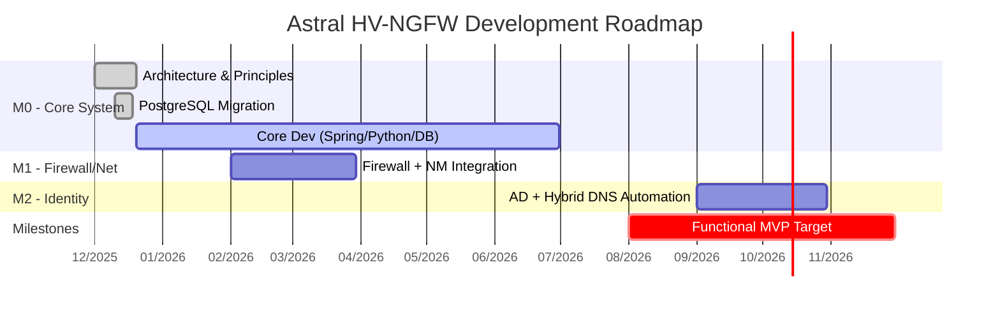
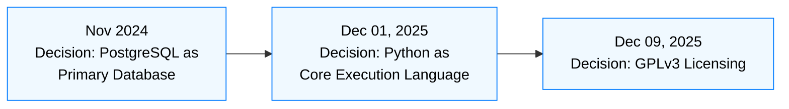
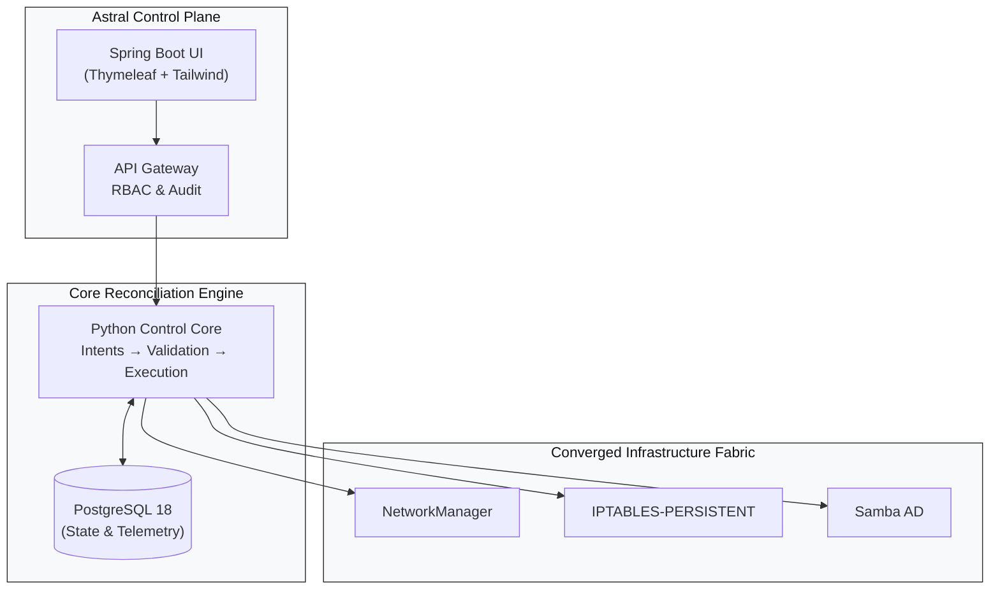
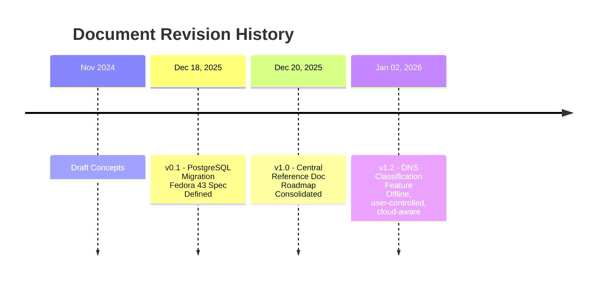

# Astral PLATAFORM & HCI – Reference and Updates Document
#  
**Living Document – Version 1.3**  
**Last updated:** AUGUST 27, 2026  

---

## 📋 ABOUT THIS DOCUMENT  
*(unchanged)*

---

## 📅 UPDATE TIMELINE  

### **DECEMBER 18, 2025 – Version 0.1**  
*(unchanged)*  

### **DECEMBER 20, 2025 – Version 1.0**  
*(unchanged)*  

### **JANUARY 2, 2026 – Version 1.2**
**New Feature**: **Context-Aware DNS Classification and Selection**
- **Reason**: Enable offline, auditable, user-controlled DNS selection aligned with Astral principles
- **Source Data**: Public DNS list from `public-dns.info` (CSV-based, no live API calls)
- **Classification Criteria**: 
- ✅ **Cloud Provider** (via `as_org`: Google, Cloudflare, AWS, etc.) 
- ✅ **Country** (via `country_code`) 
- ✅ **Reliability ≥ 0.95 + DNSSEC = true**
- **Integration**: 
- Fully embedded in **Layer 4 (Network)** and **Layer 5 (Firewall)** 
- User selects DNS interactively during setup 
- Selection propagates to **Pi-hole**, **dnsmasq**, and **firewall policies**
- **Philosophy Alignment**: 
- ✅ **Fallback over Dependency**: All data stored locally 
- ✅ **Human Authority**: User chooses DNS 
- ✅ **Auditability**: Selected DNS logged in PostgreSQL

### **AUGUST 27, 2026 – Version 1.3 (Current)**
**New Feature**: **Samba AD DC Multi-Distro Scripts & Unified Web Installer**
- **Reason**: Expand identity layer support to major Linux families and streamline initial setup via web UI.
- **Samba AD DC Scripts**: 
- ✅ **Fedora/AlmaLinux**: `fedoradc-SSL.py` (with SSL/Step-CA) and `fedora42dc.py` (without SSL). 
- ✅ **Arch Linux**: `arch-DC-SSL.py` (with SSL) and `arch42dc-no-ssl.py` (without SSL). 
- ✅ **Debian 13**: `debian13-dc-ssl.py` (with SSL, AppArmor, modular BIND) and `debian13-dc-no-ssl.py` (without SSL). 
- 🔐 **Standardization**: All scripts now use `auth.env` for sensitive configurations (`HOSTNAME_COMPLETO`, `REALM`, `SENHA_ADMIN`, `CERT_PWD`, etc.). 
- 🛡️ **Distro-Specific Security**:
- Fedora/RHEL: SELinux configuration included. 
- Debian: Custom AppArmor profiles for Samba and BIND. 
- Arch: Path and package adjustments (`pacman`, `iptables-services`).

- **Unified Web Installer (`instalador.py` + `frontend/index.html`)**:
- 🚀 **Execution**: Runs via `sudo python3 instalador.py` directly from the Git repository root. 
- 🌐 **Remote Access**: Built-in Flask server accessible via a browser on another machine (`http://SERVER_IP:5000`). 
- 🔄 **10-Step Workflow**:
1. Execution with `sudo` in the Git directory. 
2. Automatic machine IP detection. 
3. Access address displayed in the terminal. 
4. SSE (Server-Sent Events) handshake with the frontend. 
5. Repository synchronization (`apt-get update` / `dnf makecache` / `pacman -Sy`). 
6. Silent installation of Node.js and NPM. 
7. **PostgreSQL installation with real-time feedback** (displays the package name being installed and a progress bar). 
8. Socket validation on port 5432 and service startup. 
9. Transition to the credentials form (Admin User and Master Password). 
10. Creation of the superuser and the **`astral`** database via `sudo -i -u postgres psql`. 
- 🧠 **Automatic Distro Detection**:
- Reads `/etc/os-release` to identify Debian/Ubuntu, RHEL/Fedora/Alma, or Arch Linux. - Automatically adapts commands (`apt`, `dnf`, `pacman`) and package names. 
- 🗄️ **`astral` Database Creation**: The installer automatically creates the application's main database and grants full privileges to the created user. 
- 🎨 **React-like Frontend**: A clean interface featuring an animated progress bar, a real-time installation log, and a smooth transition to the final dashboard.
---

## 🎯 FUNDAMENTAL PRINCIPLES (IMMUTABLE)  
*(unchanged)*

---

## 🏗️ IMPLEMENTATION STATUS BY LAYER  

```mermaid
flowchart TB
    subgraph L_APP [Application & Orchestration]
        direction TB
        L1["Layer 1: UI & Orchestration<br/>(Spring Boot + Tailwind)<br/>🔄 In Dev (15%)"]
        L2["Layer 2: Core Python Service<br/>(Structure Defined)<br/>🔄 In Dev (10%)"]
        L3["Layer 3: PostgreSQL Database<br/>(Schema & Extensions)<br/>✅ Updated (20%)"]
    end

    subgraph L_NET [Network & Security]
        direction TB
        L4["Layer 4: Network (NM)<br/>✅ Enhanced with DNS classification"]
        L5["Layer 5: Firewall (nftables)<br/>✅ Enhanced with DNS policy enforcement"]
        L6["Layer 6: Identity (Samba AD)<br/>✅ POC Implemented"]
        L7["Layer 7: Hybrid DNS<br/>✅ POC Implemented + upstream selection"]
    end

    subgraph L_INFRA [Infrastructure & Ops]
        direction TB
        L8["Layer 8: Hypervisor (KVM)<br/>📋 Planned (0%)"]
        L9["Layer 9: Citrix CVAD<br/>📋 Defined (Config Only)"]
        L10["Layer 10: Package System<br/>📋 In Design (2%)"]
        L11["Layer 11: Observability<br/>📋 In Design (3%)"]
    end

    %% Styling
    classDef implemented fill:#d4edda,stroke:#155724,stroke-width:2px;
    classDef inprogress fill:#fff3cd,stroke:#856404,stroke-width:2px;
    classDef planned fill:#e2e3e5,stroke:#383d41,stroke-width:1px;

    class L3,L4,L5,L6,L7 implemented;
    class L1,L2 inprogress;
    class L8,L9,L10,L11 planned;
```



---

## 🔄 DYNAMIC ROADMAP



> *(Roadmap will be updated continuously as work progresses)*

---

## 🐛 ARCHITECTURAL DECISION LOG



---

## 📊 UPDATED TECHNICAL SPECIFICATIONS

### **Official Development Environment**
- **OS**: Fedora 43 Workstation / Server
- **Architecture**: x86_64
- **Minimum RAM**: 4 GB
- **Storage**: 25 GB minimum
Core Backend: Python 3.12+
  - Modules: psycopg2, sqlalchemy, flask, csv, ipaddress
  - Framework: Custom (no Django/Flask for core)

UI/Orchestration: Spring Boot 3.2+
  - Template Engine: Thymeleaf
  - CSS Framework: Tailwind CSS
  - Authentication: Spring Security + Samba AD

Database: PostgreSQL 18+
  - Extensions: timescaledb, pg_stat_statements, pgcrypto
  - Connection Pooling: HikariCP (Spring) / psycopg2.pool (Python)

System Integration:
  - Network: NetworkManager (nmcli/dbus via Python)
  - Firewall: iptables/nftables (Python wrapper)
  - DNS: Hybrid (Pi-hole + dnsmasq) with **offline public DNS catalog**
  - Identity: Samba 4.20+ (AD Domain Controller)

Data Sources (Offline):
  - public-dns.info CSV (nameservers.csv) → embedded at build time
  - Cloud IP ranges (AWS, GCP, Azure, OVH) → optional enrichment


### **Technology Stack**
```text
Core Backend: Python 3.12+
  - Modules: psycopg2, sqlalchemy, flask (internal APIs)
  - Framework: Custom (no Django/Flask for core)

UI/Orchestration: Spring Boot 3.2+
  - Template Engine: Thymeleaf
  - CSS Framework: Tailwind CSS
  - Authentication: Spring Security + Samba AD

Database: PostgreSQL 18+
  - Extensions: timescaledb, pg_stat_statements, pgcrypto
  - Connection Pooling: HikariCP (Spring) / psycopg2.pool (Python)

System Integration:
  - Network: NetworkManager (nmcli/dbus via Python)
  - Firewall: iptables/nftables (Python wrapper)
  - Virtualization: KVM/libvirt (Python bindings)
  - Identity: Samba 4.20+ (AD Domain Controller)
```

---

## 🖼️ HIGH-LEVEL ARCHITECTURE



---

## ⚠️ KNOWN LIMITATIONS AND RESTRICTIONS

### **Current Restrictions**
- ❌ **No Docker support**: Native installation only (Fedora/RHEL)
- ❌ **No Citrix VDI included**: Only config compatibility if user provides Citrix
- ⚠️ **Minimum 4 GB RAM** required for basic operation
- 🔧 **Nested virtualization required** for development environments

---

## 🤝 COLLABORATION MODEL

### **For Developers**
- Fork the repository (when public)
- Consult this document for architectural context
- Adhere to the four fundamental principles

### **For Testers / Users**
- Report issues with clear use-case scenarios
- Provide UX feedback

---

## 🏷️ DOCUMENT VERSION HISTORY



---

## 🚨 FINAL WARNING

This is a **living development document**.

All specifications, architecture, and documented decisions are **subject to change without notice**. This document reflects the current state of thinking and development for the **Astral HV-NGFW** project, but **does not constitute a final commitment** to any specific implementation.
