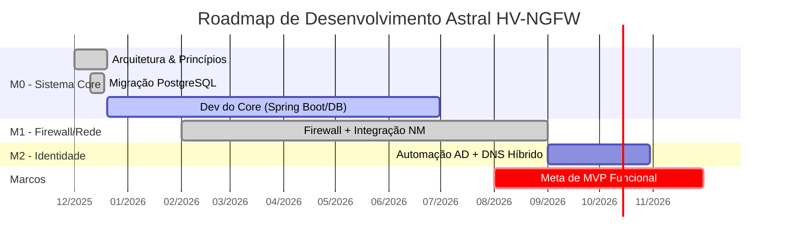
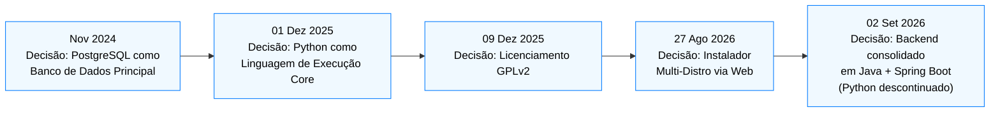
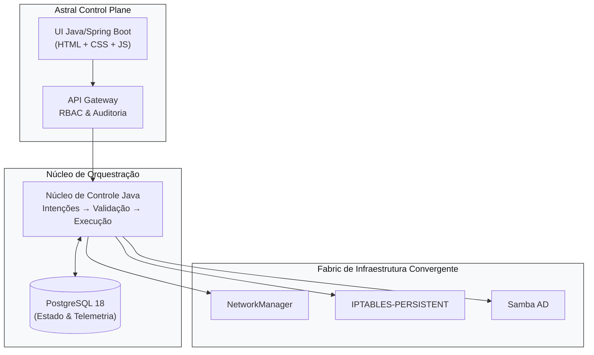
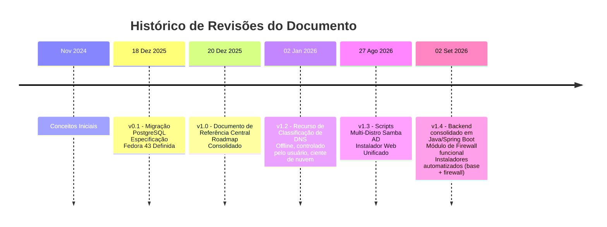

# Astral Platform & HCI – Documento de Referência e Atualizações
#
**Documento Vivo – Versão 1.4**
**Última atualização:** 02 DE SETEMBRO DE 2026

---

## 📋 SOBRE ESTE DOCUMENTO
*(inalterado)*

---

## 📅 LINHA DO TEMPO DE ATUALIZAÇÕES

### **18 DE DEZEMBRO DE 2025 – Versão 0.1**
*(inalterado)*

### **20 DE DEZEMBRO DE 2025 – Versão 1.0**
*(inalterado)*

### **02 DE JANEIRO DE 2026 – Versão 1.2**
**Novo recurso**: **Classificação e Seleção de DNS Sensível a Contexto**
- **Motivo**: Habilitar seleção de DNS offline, auditável e controlada pelo usuário, alinhada aos princípios da Astral
- **Fonte de dados**: Lista pública de DNS do `public-dns.info` (baseada em CSV, sem chamadas de API ao vivo)
- **Critérios de classificação**:
  - ✅ **Provedor de nuvem** (via `as_org`: Google, Cloudflare, AWS, etc.)
  - ✅ **País** (via `country_code`)
  - ✅ **Confiabilidade ≥ 0,95 + DNSSEC = true**
- **Integração**:
  - Totalmente embutida na **Camada 4 (Rede)** e **Camada 5 (Firewall)**
  - Usuário seleciona o DNS interativamente durante a configuração
  - A seleção se propaga para **Pi-hole**, **dnsmasq** e **políticas de firewall**
- **Alinhamento filosófico**:
  - ✅ **Fallback acima de dependência**: todos os dados armazenados localmente
  - ✅ **Autoridade humana**: o usuário escolhe o DNS
  - ✅ **Auditabilidade**: DNS selecionado registrado no PostgreSQL

### **27 DE AGOSTO DE 2026 – Versão 1.3**
**Novo recurso**: **Scripts Multi-Distro do Samba AD DC & Instalador Web Unificado**
- **Motivo**: Expandir o suporte da camada de identidade para as principais famílias Linux e simplificar a configuração inicial via UI web.
- **Scripts Samba AD DC**:
  - ✅ **Fedora/AlmaLinux**: `fedoradc-SSL.py` (com SSL/Step-CA) e `fedora42dc.py` (sem SSL).
  - ✅ **Arch Linux**: `arch-DC-SSL.py` (com SSL) e `arch42dc-no-ssl.py` (sem SSL).
  - ✅ **Debian 13**: `debian13-dc-ssl.py` (com SSL, AppArmor, BIND modular) e `debian13-dc-no-ssl.py` (sem SSL).
  - 🔐 **Padronização**: todos os scripts agora usam `auth.env` para configurações sensíveis (`HOSTNAME_COMPLETO`, `REALM`, `SENHA_ADMIN`, `CERT_PWD`, etc.).
  - 🛡️ **Segurança específica por distro**:
    - Fedora/RHEL: configuração de SELinux incluída.
    - Debian: perfis customizados de AppArmor para Samba e BIND.
    - Arch: ajustes de path e pacotes (`pacman`, `iptables-services`).
- **Instalador Web Unificado (`instalador.py` + `frontend/index.html`)**:
  - 🚀 **Execução**: roda via `sudo python3 instalador.py` diretamente da raiz do repositório Git.
  - 🌐 **Acesso remoto**: servidor Flask embutido, acessível via navegador em outra máquina (`http://IP_DO_SERVIDOR:5000`).
  - 🔄 **Fluxo de 10 etapas**:
    1. Execução com `sudo` no diretório do Git.
    2. Detecção automática do IP da máquina.
    3. Endereço de acesso exibido no terminal.
    4. Handshake SSE (Server-Sent Events) com o frontend.
    5. Sincronização do repositório (`apt-get update` / `dnf makecache` / `pacman -Sy`).
    6. Instalação silenciosa do Node.js e NPM.
    7. **Instalação do PostgreSQL com feedback em tempo real** (mostra o pacote sendo instalado e uma barra de progresso).
    8. Validação de socket na porta 5432 e início do serviço.
    9. Transição para o formulário de credenciais (usuário admin e senha mestra).
    10. Criação do superusuário e do banco **`astral`** via `sudo -i -u postgres psql`.
  - 🧠 **Detecção automática de distro**:
    - Lê `/etc/os-release` para identificar Debian/Ubuntu, RHEL/Fedora/Alma ou Arch Linux.
    - Adapta automaticamente os comandos (`apt`, `dnf`, `pacman`) e os nomes de pacotes.
  - 🗄️ **Criação do banco `astral`**: o instalador cria automaticamente o banco principal da aplicação e concede privilégios totais ao usuário criado.
  - 🎨 **Frontend estilo React**: interface limpa com barra de progresso animada, log de instalação em tempo real e transição suave para o dashboard final.

### **02 DE SETEMBRO DE 2026 – Versão 1.4 (Atual)**
**Consolidação de stack**: **Backend unificado em Java + Spring Boot**
- **Motivo**: Reduzir a superfície de tecnologias do core, eliminar a duplicidade entre o serviço Python planejado e a camada Spring Boot, e simplificar operação/deploy.
- **Backend**:
  - ✅ **Java + Spring Boot** é agora a **única** tecnologia de backend do projeto — cobre UI, orquestração e os módulos de infraestrutura (ex.: Firewall).
  - ❌ O núcleo em Python (antes previsto na Camada 2) foi **descontinuado**. Toda a lógica anteriormente planejada em Python (validação, reconciliação, execução) passa a ser implementada em Java.
- **Frontend**:
  - ✅ **JavaScript, HTML e CSS puros** — sem framework de build (sem React/Vue no momento).
  - 📋 **Node.js**: reservado para uso futuro (ex.: build tooling, SSR de componentes mais complexos); **ainda não adotado** no projeto.
- **Instaladores automatizados**:
  - 🧩 **Instalador do Sistema Base** (`Installer.java`): provisiona pacotes e dependências do zero — Java/JDK, PostgreSQL, systemd units, estrutura do projeto (`fabric/`, `src/`), banco `astral`, usuário administrador e a própria plataforma principal (`astral-platform`).
  - 🧩 **Instalador do Módulo de Firewall** (`InstallerFirewall.java`): standalone, provisiona especificamente o serviço `astral-firewall` (Spring Boot + iptables), incluindo build Maven, unit systemd, e liberação inicial de portas.
  - Ambos os instaladores são **idempotentes** (podem ser executados novamente com segurança) e rodam como processos Java autônomos via `sudo java <Instalador>.java`, sem dependência de gerenciadores de pacote Python.
- **Módulo de Firewall**: passa de "planejado" para **funcional** — ver Camada 5 abaixo.

---

## 🎯 PRINCÍPIOS FUNDAMENTAIS (IMUTÁVEIS)
*(inalterado)*

---

## 🏗️ STATUS DE IMPLEMENTAÇÃO POR CAMADA

```mermaid
flowchart TB
    subgraph L_APP [Aplicação & Orquestração]
        direction TB
        L1["Camada 1: UI & Orquestração<br/>(Java + Spring Boot)<br/>🔄 Em Dev (25%)"]
        L2["Camada 2: Núcleo de Serviços<br/>(Java + Spring Boot — Python descontinuado)<br/>🔄 Em Dev (15%)"]
        L3["Camada 3: Banco de Dados PostgreSQL<br/>(Schema & Extensões)<br/>✅ Atualizado (20%)"]
    end

    subgraph L_NET [Rede & Segurança]
        direction TB
        L4["Camada 4: Rede (NetworkManager)<br/>✅ Aprimorada com classificação de DNS"]
        L5["Camada 5: Firewall (iptables)<br/>✅ Funcional — regras, NAT/Port Forwarding,<br/>Masquerade, Rate Limiting e Modo Pânico"]
        L6["Camada 6: Identidade (Samba AD)<br/>✅ POC Implementado"]
        L7["Camada 7: DNS Híbrido<br/>✅ POC Implementado + seleção de upstream"]
    end

    subgraph L_INFRA [Infraestrutura & Operações]
        direction TB
        L8["Camada 8: Hypervisor (KVM)<br/>📋 Planejado (0%)"]
        L9["Camada 9: Citrix CVAD<br/>📋 Definido (Somente Config)"]
        L10["Camada 10: Sistema de Pacotes<br/>e Instaladores Automatizados<br/>✅ Base + Firewall implementados"]
        L11["Camada 11: Observabilidade<br/>📋 Em Design (3%)"]
    end

    %% Estilos
    classDef implemented fill:#d4edda,stroke:#155724,stroke-width:2px;
    classDef inprogress fill:#fff3cd,stroke:#856404,stroke-width:2px;
    classDef planned fill:#e2e3e5,stroke:#383d41,stroke-width:1px;

    class L3,L4,L5,L6,L7,L10 implemented;
    class L1,L2 inprogress;
    class L8,L9,L11 planned;
```



---

## 🔄 ROADMAP DINÂMICO



> *(O roadmap será atualizado continuamente conforme o trabalho avança)*

---

## 🐛 REGISTRO DE DECISÕES ARQUITETURAIS



---

## 📊 ESPECIFICAÇÕES TÉCNICAS ATUALIZADAS

### **Ambiente de Desenvolvimento Oficial**
- **SO**: Fedora 43 Workstation / Server
- **Arquitetura**: x86_64
- **RAM mínima**: 4 GB
- **Armazenamento**: 25 GB mínimo

### **Stack Tecnológica**
```text
Backend: Java 21 + Spring Boot 3.2+ (única tecnologia de backend)
  - Cobre: UI, orquestração, API reativa (WebFlux) e módulos de infraestrutura
  - Persistência: Spring Data JPA / Hibernate
  - Connection Pooling: HikariCP

Frontend: HTML, CSS e JavaScript puros
  - Sem framework de build no momento (sem React/Vue)
  - Node.js: reservado para uso futuro, ainda não adotado

Banco de Dados: PostgreSQL 18+
  - Extensões: timescaledb, pg_stat_statements, pgcrypto

Integração com o Sistema:
  - Rede: NetworkManager (nmcli, via processo Java)
  - Firewall: iptables (módulo Java/Spring Boot dedicado, sincronização
    em tempo real entre banco de dados e regras aplicadas)
  - DNS: Híbrido (Pi-hole + dnsmasq) com catálogo público de DNS offline
  - Identidade: Samba 4.20+ (Controlador de Domínio AD)

Instaladores Automatizados (Java, standalone):
  - Sistema Base: pacotes, dependências, PostgreSQL, systemd, plataforma principal
  - Módulo de Firewall: build Maven, unit systemd, regras iniciais via iptables

Fontes de Dados (Offline):
  - CSV do public-dns.info (nameservers.csv) → embutido em tempo de build
  - Faixas de IP de nuvem (AWS, GCP, Azure, OVH) → enriquecimento opcional
```

---

## 🖼️ ARQUITETURA DE ALTO NÍVEL



---

## ⚠️ LIMITAÇÕES E RESTRIÇÕES CONHECIDAS

### **Restrições Atuais**
- ❌ **Sem suporte a Docker**: instalação nativa apenas (Fedora/RHEL)
- ❌ **Sem Citrix VDI incluído**: apenas compatibilidade de configuração se o usuário fornecer o Citrix
- ⚠️ **Mínimo de 4 GB de RAM** exigido para operação básica
- 🔧 **Virtualização aninhada necessária** para ambientes de desenvolvimento

---

## 🤝 MODELO DE COLABORAÇÃO

### **Para Desenvolvedores**
- Fork do repositório (quando público)
- Consultar este documento para contexto arquitetural
- Aderir aos quatro princípios fundamentais

### **Para Testadores / Usuários**
- Reportar problemas com cenários de uso claros
- Fornecer feedback de UX

---

## 🏷️ HISTÓRICO DE VERSÕES DO DOCUMENTO



---

## 🚨 AVISO FINAL

Este é um **documento vivo de desenvolvimento**.

Todas as especificações, arquitetura e decisões documentadas estão **sujeitas a alteração sem aviso prévio**. Este documento reflete o estado atual do pensamento e desenvolvimento do projeto **Astral HV-NGFW**, mas **não constitui um compromisso final** com nenhuma implementação específica.
